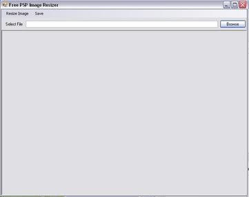
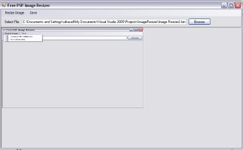
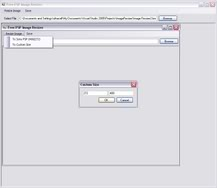
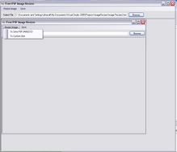
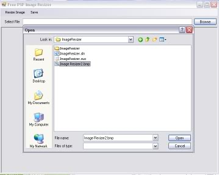
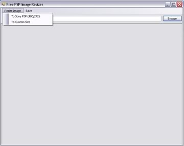

Coded in VB.NET (requires .net framework 2.0 to run)
PM me 4 the source code

Completly free not a demo or trial

<a href="http://s2.quicksharing.com/v/1776353/ImageResizer.exe.html" target="_blank" rel="nofollow">http://s2.quicksharing.com/v/1776353/ImageResizer.<wbr />exe.html</a>
<a href="http://s2.quicksharing.com/v/1776353/ImageResizer.exe.html" target="_blank" rel="nofollow">http://s2.quicksharing.com/v/1776353/ImageResizer.<wbr />exe.html</a>
<a href="http://s2.quicksharing.com/v/1776353/ImageResizer.exe.html" target="_blank" rel="nofollow">http://s2.quicksharing.com/v/1776353/ImageResizer.<wbr />exe.html</a>
<a href="http://s2.quicksharing.com/v/1776353/ImageResizer.exe.html" target="_blank" rel="nofollow">http://s2.quicksharing.com/v/1776353/ImageResizer.<wbr />exe.html</a>
<a href="http://s2.quicksharing.com/v/1776353/ImageResizer.exe.html" target="_blank" rel="nofollow">http://s2.quicksharing.com/v/1776353/ImageResizer.<wbr />exe.html</a>
<a href="http://s2.quicksharing.com/v/1776353/ImageResizer.exe.html" target="_blank" rel="nofollow">http://s2.quicksharing.com/v/1776353/ImageResizer.<wbr />exe.html</a>
<a href="http://s2.quicksharing.com/v/1776353/ImageResizer.exe.html" target="_blank" rel="nofollow">http://s2.quicksharing.com/v/1776353/ImageResizer.<wbr />exe.html</a>
<a href="http://s2.quicksharing.com/v/1776353/ImageResizer.exe.html" target="_blank" rel="nofollow">http://s2.quicksharing.com/v/1776353/ImageResizer.<wbr />exe.html</a>
<a href="http://s2.quicksharing.com/v/1776353/ImageResizer.exe.html" target="_blank" rel="nofollow">http://s2.quicksharing.com/v/1776353/ImageResizer.<wbr />exe.html</a>
<a href="http://s2.quicksharing.com/v/1776353/ImageResizer.exe.html" target="_blank" rel="nofollow">http://s2.quicksharing.com/v/1776353/ImageResizer.<wbr />exe.html</a>
<a href="http://s2.quicksharing.com/v/1776353/ImageResizer.exe.html" target="_blank" rel="nofollow">http://s2.quicksharing.com/v/1776353/ImageResizer.<wbr />exe.html</a>

Features
* Fixed Bugs in Saving to the psp
* Fixed Bugs in saving to the pc
* Added Image Flipping
* Added Image Rotating
* Added splash screen
* This is a freeware PSP image resizer it Includes;
* Freeware No Registration Necessary
* No Install Necessary
* LightWeight (only 48 kb Less than most flash games)
* Dosent Cut Off Sides Changes the aspect ratio
* One click Resizing to 480/272 pixels
* Built in Direct Output To PSP Images
* Easy To Use
* I made it
* 1 click resize to psp
* custom resizing
* image preview
* easy to use

Large amount of supported extentions include

+ jpg
+ bmp
+ png
+ gif
+ wmf
+ tiff

### SCREENSHOTS of verion 1

