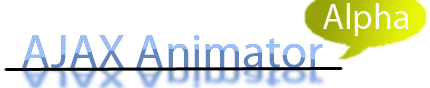

Gmail revolutionized email by offering a web based equivalent to Outlook and Thunderbird, except this was completely web based. No more Installing. So did Google Docs and Spreadsheets, or Zoho office, or etc, they had entirely free and web based clones of Microsoft Office or OpenOffice. Or Microsoft Windows, then there is Linux and now there is desktoptwo eyeos and youos.
I think of it as a development cycle, somebody makes something that is expensive, then something free, then something entirely Web based.
Now, what about Flash. According to adobe, 97% of all people who browse the Internet have flash player installed. By far larger than the amount of people who have outlook, thunder bird, Microsoft office, or Openoffice installed. Flash also accounts for a large percent of So why isn't there a freeware open source replacement to this $400 software? There are though, UIRA, F4L, QFlash, KDSFlash, and more, but they are early in development. So when is the third generation web 2.0 equivalent for animation software coming? This is what I want to develop.
This is a project to make an open-source browser based Flash Authoring system.

Please post comments in the shout box.
