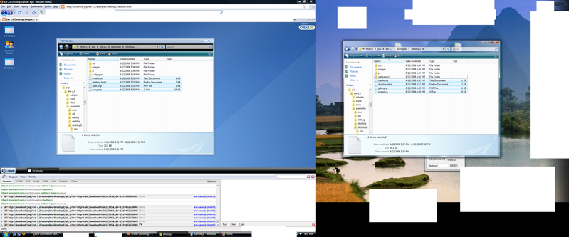

Well, I worked on a sort of VNC-like solution to controlling native desktop applications from a remote PC. It's an interesting concept, I settled with something less than easy to use, and less than really feasable. It's a Proof of concept, and it's likely I won't work on it again (Like ForkSwif).

It is an application (module) on a hacked Ext 2.0 Desktop example that uses Ajax (Polling) to query a local PHP proxy to query a remote desktop. The remote desktop is running some software (powered by .NET sadly...) that captures the window's contents, does a diff to see if there are modifications and where (only sends updates to changed parts of the screen, sorta like VNC). It base64 encodes it and sends it along HTTP to the proxy, which sends it to the javascript client.

The client can send events to be repeated on the remote desktop, currently only left mousedown and mouseup (so, basically only clicking), but using the Keyboard should be easy enough.

I imagine that a more feasable option is to create a javascript X11 client, taking proxied connections to a X session under SSH so it is better with window-specificness, and an overall more stable platform, so you could also run multiple applications simultaneously on the desktop.

here's an early screenshot:

 Controlling A native desktop app from a javascript desktop (early build)

Files here:

[http://antimatter15.110mb.com/misc/coolstuff.zip](../../misc/coolstuff.zip)

Extract desktop2 to your Apache server, start Windows Calculator (or another app of your choosing). Run Screen.exe, type the app title, press "Get Handle" and check the "Run Server" box. Navigate to the desktop.html (on your PHP-enabled apache), and start the "NV Window" app.

To be able to control the app, you have to set it to your network ip (not localhost) on a VM or a different computer. and configure sample.js at line 191.

proxy: "gdat.php?url=",
updateurl : "[http://localhost:12345](http://localhost:12345/)",
baseurl : "[http://localhost:12345/base](http://localhost:12345/base)",
showimg : false,
uinterval: 1000,
updater: null,
xoffset: -8,
yoffset: -28,

change localhost to the server's IP. And tick "Control Desktop"

Note that you need firebug.

If i can think of a name for the app, i'll be sure to creakte a google code project for it. so if anyone want's the source, think of a name for it.
