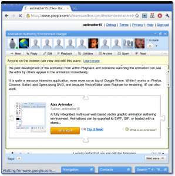

[https://wave.google.com/a/wavesandbox.com/#minimized:search,restored:wave:wavesandbox.com!w%252B3JUS0MHA%2525A.1](https://wave.google.com/a/wavesandbox.com/#minimized:search,restored:wave:wavesandbox.com!w%252B3JUS0MHA%2525A.1)

If you have a Google Wave developer account, you can visit the above link to use the gadget. It supports almost all the features of the full normal Ajax Animator and many more. It includes better Text, Images, Rotation, Resizing (still needs work), Layer Visibility, Stability, Platform Support, Export options, etc. However it does notably lack the entire old right (east) panel, which also means no undo, or redo. Also since it uses a different graphics editor (VectorEditor), it does not have all the transform options which were present in OnlyPaths. It also supports the whole real time editing that Wave is so famous for. Two people can concurrently edit the same frame at the same time or one user can watch the animation while the others are editing and see the animation develop.

If you aren't fortunate enough to use wave, you can use it without the collaborative features at [http://antimatter15.com/ajaxanimator/wave/](http://antimatter15.com/ajaxanimator/wave/)
