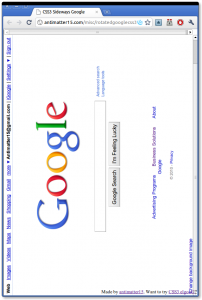

I was surprised to find that one of the main referrers to my site recently has been Twitter. Looking into it, it seems to all be for my quickly hacked together [CSS3 Sideways Google](http://antimatter15.com/misc/rotatedgooglecss3.html). Which uses the new CSS3 transforms supported by Webkit and Gecko (Firefox, Chrome and Safari) as well as the freaky DirectX stuff Microsoft has (Only major browser that isn't supported is Opera, who is lagging a bit).

And in the spirit of CSS3 Sideways Google, I present [CSS3 elgooG](http://antimatter15.com/misc/elgoogcss3.html)

It also appears that the awesome [rotateme.org](http://rotateme.org) website was built entirely off of the original CSS3 Sideways Google and actually got 1500 diggs :)
