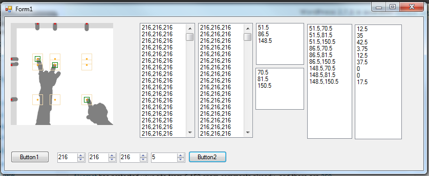

Early on, I recognized one of the biggest issues with my idea for using mirrors was the computational power necessary to run the finger-position-detection algorithm. I recently thought, that that would be totally superfluous.
My new idea is to use software to search a 1-pixel wide band of the mirrors to create several points. Those points are all combined to a list of all possible permutations. Each point goes through a method of determining whether or not it's a fingertip. The easiest way, (and likely quite wildly inaccurate in the real world), is to measure the perimeter of a square that has that point of the center and compare it to the percent of that perimeter which is different from the surroundings. So then, you find the ones which work at all, and then you have your points!

I actually made a rough proof-of-concept system for this. It uses a very crude method of determining the different blobs on the mirrors (contiguous same color). And it uses a very crude surrounding box perimeter-ratio system. It's to serve as a proof-of-concept type thing, not necessarily the precursor to an actual program that does something along the lines of it.

As for how fast it is, i'm not sure. I don't even know how things like touchlib do it. If they scan through every pixel, and do more processing, then this is easily 50x faster. The speed of this is very largely dependent on the number of fingers touching it. w+h+4bf^2 would be a rough approximation of how many pixels would be needed to processed to get the result (w = width resolution, h = height resolution, b = size of surrounding box, f = number of fingers). On the Proof-of-concept, the input data is 200x200, The box set to a width of 20px, and there are 3 fingers touching, meaning ~1120 pixels searched. And if you were to scan through all the pixels (as I originally thought the idea would require), it would be wh, or 200*200, or 40,000\. So the speed increase is by a factor of 36x, which is totally awesome. But again, I don't know how others do it, they may have already an even faster way. But last year, I made a sort of object-tracking thing, which worked by scanning every pixel, and it was able to work at quite decent speed. So this, being an order of magnitude faster should work better.

Of course this is still a concept. There are still huge flaws not yet covered for like the fact in the real-world, the software would have to soemhow distinguish between the contents on the monitor and the hand in front. There may be a chance that someone is in an awkward position which tricks the software, the fact the software is completely  useless on just about anything other than a fingertip, and many many more. I still find it interesting anyway :P
