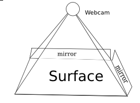
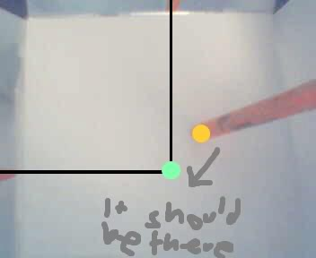
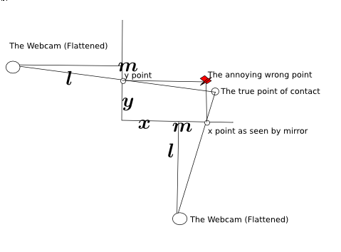
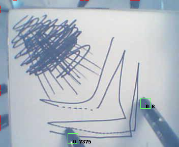

MirrorTouch (the new name for my mirror-based multitouch system). For those who don't remember, it is a project to create a retrofittable cheap new technology for touch detection. It can be made of mostly off-the-counter or even household items. The software has the potential to be VERY fast, many orders of magnitude faster than the current technology. It is less seceptable to occlusion than many other technologies.

It began well over 2 months ago. It started out with IDEALISTIC paint sketches and then a VB.NET application to parse it. Then it was ported to Python and could handle the same sketches. After discovering that in real life the positioning of the points varies due to some very strange and illogical factor, the project had a several-month hiatus.

The issue is clearly demonstrated here:

Last week, I considered the project a failure. I was playing around with a flashlight and tried looking into the strange behavior of the light. And something began to dawn on me. The shape as on diagram 1, can be flattened out as a visualization for what it behaves like. So from the pyramid shape, it looks more like a little 4-pointed star. Since the mirror is only on two sides, you can simplify it to half a star emerging from a square.

To the side is a geometicalified sketch of it from my notebook. Here you can see the relation between the point and where it shows up on the mirror.

From that, you can use the distance between _m_ and the y point (_y-m_) and divide it all over the distance from the mirror to the webcam (_l_) and plug it into _y=mx+c_ form. Repeat that over the x axis and you can use basic algebra to find the interesction.

From that is the new magical formula that powers the application:

The new formula is so magical that it actually works. Yes, it's amazing, it has survived the most strictest of tests of mathematical consistency. It _works._.... At least in theory. Now what about _scientific_ tests? Oh no! it actually has to work in the _physical_ world? Oh no!

With these 2 magical equations. I have (theoretically) in an idealistic model of the system, solved the issue with distortion. It should theoretically resolve all issues with the system. It should work.

So i set up the model again, attaching my webcam to a ruler and taping it to a speaker. Taping mirrors down on a piece of paper, and this time, Scribbling down measurements on the side. I got it to work. Workign without resetting configuration every time it ran. It works. It truly actually works. Multi-Touch too.

Since I cant get the webcam to feed directly to the python script, I have to use Cheese (it's a linux app for taking pics from a webcam) to save screenies of the webcam mounted percariously from a ruler using only a bit of transparent Scotch tape. I copy the images over to the mirrortouch directory and go in the commandline and type in _python process.py_ and watch as lines of logging output fly past as the windows autoscrolls down filled with coordinates and color hashes.

I watch as it generates a .png file.

Yes it works! AMAZING!

Note: The random scribbles in the back aren't for any contstructive purpose. No, actually they just stop my stupid webcam from adjusting the contrast and making everything all ugly and ewwie. If my webcam sucked less than maybe it would work but my webcam really does really really really suck.

Now if it could get ported over to somethign like C++, and actually parse a live video feed from the webcam then it may become an actual working implementable multitouch technology. As it stands, it's just a multitouch proof of concept, and I don't know C++ so it probably won't work.

Anyone dying for the source code can find it in the SVN repository at : http://code.google.com/p/mirrortouch/ Just beware that it may take lots of scary and tedious configuring in current stages (Configuring color range of background in the band, configuring color range of target, setting distances and middle length and other horrors, but from the SVN you can also do the insanely boring act of running various images that are already there through the script, and most of the images just wont work even with replacing huge blocks of code).
