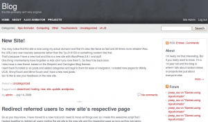

You may notice that the site is now using my actual domain! and that it's also like twice as fast and 20 times more reliable! Also, the URLs are now insanely awesome rather than the ?p=314159 or something random like that.
That's because I have a new host and this is a new site with WordPress 2.8.1 and stuff.
One thing I momentarily have forgotten is Ads (don't you love them?). So they'll be back soon.
I also have a new theme, based on the SimpleX and Carrington Blog themes.
I went back hundred or so posts and added catagories and tags to them for ease of navigation. I created new pages for Wikify, vXJS, ShinyTouch and MirrorTouch and I have a few new posts.
So I'd like to see your feedback on the new site.
