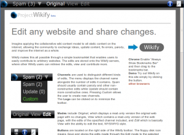

In 2008 (That long ago, I know!), I started something called [Project Wikify](http://wikify.antimatter15.com/). Basically, it was a bookmarklet which let people edit stuff on web pages and _save it onto a server_. A lot of people may be aware of the simple thing where pasting javascript:document.designMode="on"; into the URL bar makes the internet explode into awesomeness such as replacing every other word in this blog with the name of a certain genitalia. Of course, the absolutely huge issue with this is that you really can't _share_ your _awesome_ creation.

So here comes Wikify to fix that, the age-old problem of sharing your vandalized sites has been finally resolved....  a year ago. And since then, nobody really has ever cared.

So, I looked back at it last week, and realized how painfully crappy the website for it was. To fix it, I decided to test out iWeb, yes, a totally non-leet WYSIWYG editor. But yes, that's how crappy my web-design skills are, so the result is quite an improvement. Anyway, I used the Blank-Page template, so at least you can spare your eyes from yet another generic theme (*cough this blog cough*).

While designing the site, I tried out Wikify and discovered that it didn't work on Wikipedia articles and the News button didn't work. So I quickly got those features working, so now i'm writing this blog post about my tiny edits and the new site.

[http://wikify.antimatter15.com/](http://wikify.antimatter15.com/)
