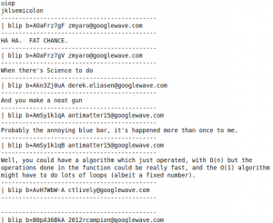

 Very exciting, I know.

Some people have probably heard of WaveBoard, the application for iPhone and OS X that claims to be a desktop client for wave. However, it's really just a webkit browser that has some extra triggers for some better desktop integration. But it's still not a real Wave client. Obviously cause doing so would be insanely hard and since the Client/Server protocol isn't released, has to be reverse engineered.

So I reverse engineered part of Wave that allows an entire wave to be downloaded and parsed into blips with tree structure.

I'm careful to title this a Wave desktop reader because it only does reading and in the crudest of forms.

[http://static-bot.appspot.com/view/?id=googlewave.com!w+Ze3l0mj0A](http://static-bot.appspot.com/view/?id=googlewave.com!w+Ze3l0mj0A) the state of Google Wave does seem to have changed, so this post, from June 30th 2010 at 6:43am (which is what Wordpress says, but I have a hard time believing as I usually am not up that early. But obviously this commentary is from much after, after the great wave-announcement of the end of the year) Anyway, static-bot (which later became wavereader and then anonybot) has deceased in the most horrific way, and while the original Wave is still accessible, it probably won't be for long (by the time I have my next eruption of nostalgia in a few months), Wave may have already died. So It's probably best to paste information that was there into this post
> For the Google Wave Client/Server protocol documentation, scroll down. For documentation which relates to stuff other than loading a wave (eg, search, playback, etc) See ["Google Wave Protocol Documentation"](https://wave.google.com/wave/?pli=1#restored:wave:googlewave.com!w%2BTklMo2zsB)
> 
> 
> 
> I spent a bit of time with firebug trying to reverse engineer some parts of Wave's complex inner workings. I've made a offline wave reader using this amazing technology.
> 
> 
> This is way different from [Waveboard](https://wave.google.com/wave/?pli=1#restored:wave:googlewave.com!w%2BJqkvHvfWI) which is an embedded Webkit for a mac application which has some extra bindings for somewhat better desktop integration. It is *not* a _real_ desktop client (technically, neither is this, but this is closer). This one is based on a reverse engineered part of the Wave client-server protocol (which hasn't been released, hence reverse engineering).
> 
> 
> But first, to make clear the limitations:
> 
> 
> *   Does not contain a web renderer so no images, embeds, gadgets, etc
> *   Does not maintain an active connection for real time updates
> *   Can not submit updates (no OT)
> *   Can not list waves
> *   Can not create waves
> 
> So what can it do? It can read a wave, and create a raw text backup. While not terribly exciting, it's still progress. It is usually quite a bit faster than Wave at loading things.
> 
> 
> **Download (Read Usage below):
> 
> **[ http://dl.getdropbox.com/u/1024307/pywavereader/login.py](http://dl.getdropbox.com/u/1024307/pywavereader/login.py)
> 
> [ http://dl.getdropbox.com/u/1024307/pywavereader/read.py](http://dl.getdropbox.com/u/1024307/pywavereader/read.py)
> 
> 
> **Usage:
> 
> ** Yay, the fun part. This isn't very user friendly, so be warned. Unless you've used the command line before, it may be insanely scary.
> 
> 
> 1.  Download the files.
> 2.  Extract it somewhere
> 3.  Go to that directory from the command line
> 4.  Run python login.py USERNAME PASSWORD (Feel free to check the source if you're afraid its gonna steal your credentials)
> 5.  Watch as some awesome info piles down and state.txt is generated
> 6.  Run python read.py WAVEID
> 7.  This part is weirdish. Since bash (for me) throws random errors and all the waves you can see are on googlewave.com!w+ anyway, a shorter wave ID can be used which lacks the part before the + sign. For example, this wave's short ID is Ze3l0mj0A
> 8.  Watch as the wave's contents are populated onto the command line notably without order (may be fixed eventually, probably not).
> 
> **Future:**
> 
> I'm trying to find out how the Wave searches are done and that might be next, soon a mostly usable read-only wave client may be possible. It would be great if people could help in this process.
> 
> 
> Licensed under GPLv3 and made in Python (Yeah, commandline ftw). The code is pretty crappy, I'm not especially good at Python but at least it's cross platform. Probably someone could hook it up to a web server to give access to public Wave content to the general public. Maybe this will spark some future wave desktop client.
> 
> 
> And obviously, some time in september, Google will decide to shut down Wave because it was super experimental and rendered this all useless and one day on the cold not snowy monday afternoon of december twenty seventh the year 2010 though the relative epoch really isnt that important, so you could also say that it's year 40 if you use the unix epoch. And obviously this was not in the initial post.
