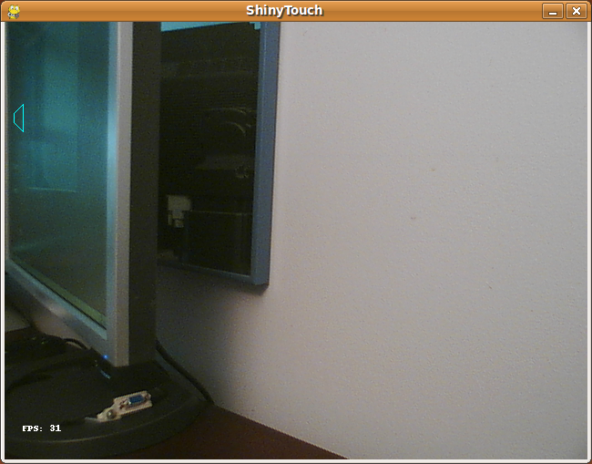
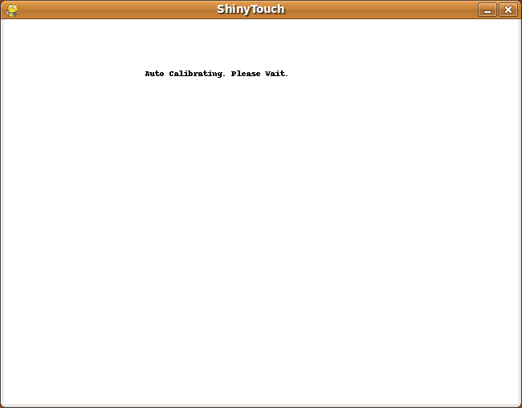
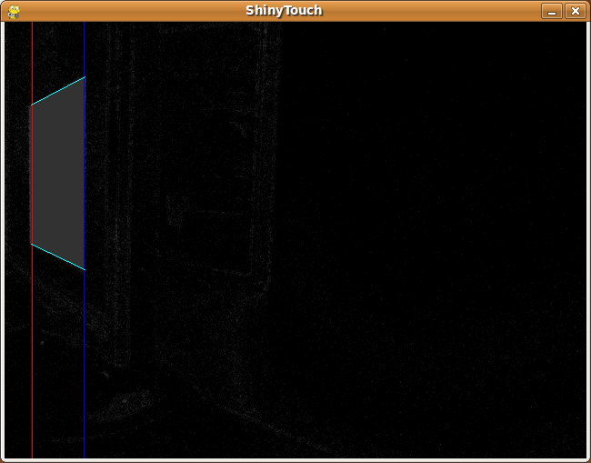
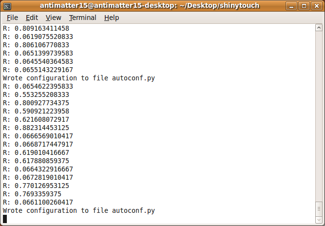
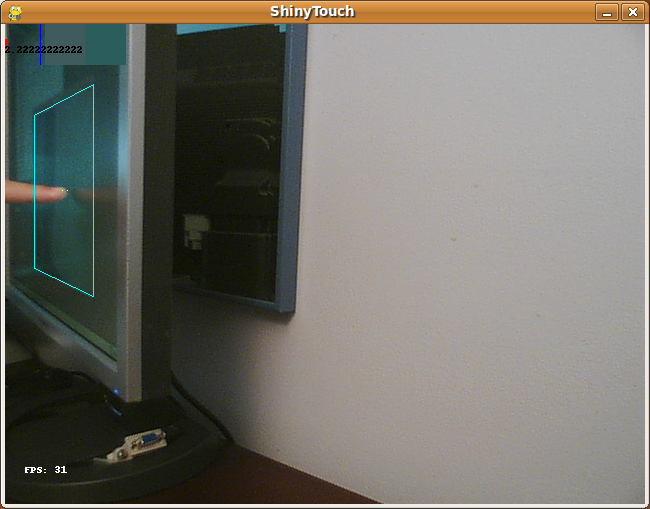
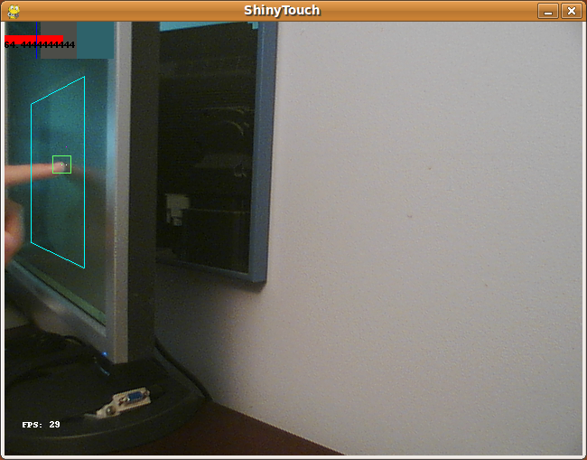
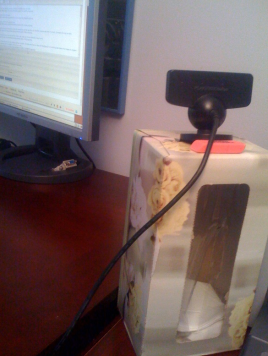

This is the app running, notice that it's not yet been calibrated yet.

Here is the auto-calibration process, it alternates between black and white

This is part of Auto-Calibration.

This is some stuff from the command line:

This is just hovering over the screen, notice it's not touching, and the algorithm can distinctly recognize the lack of a touch because the reflection is seperated from the finger by a significant gap. (Compare the top red bar).

This is a actual touch, you can see that the red bar is far larger, and it's very distinctly a touch event.

There's a draw tool and, here is a primitive drawing of a smiley. The dots come from an issue with PIL/OpenCV or something that makes the image all chopped up and sends the point to an arbitary point on the screen.

This is the magical sensor the whole thing is powered by: An unmodified Playstation 3 Eye on a tissue box with a pink Office Depot eraser on the back (because the camera is made tilted and the script can't handle those tilts very well)

It's not too insanely slow either. This is 31 frames per second coming from a pure python app, all from a scripting language. It is nowhere as fast as the normal fast native apps.
