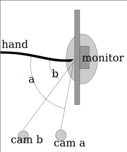
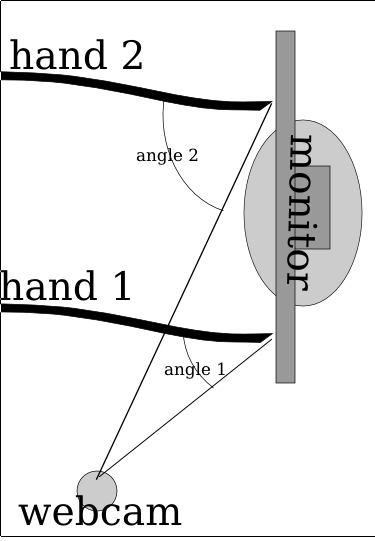
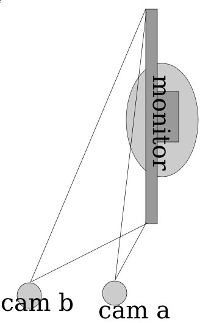
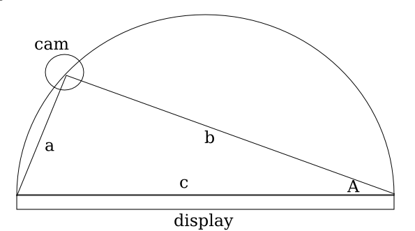

So I was looking through wikipedia to find out  if there were some magical equations to govern how it should mix the color of the background screen contents and the reflection and make the application work better. I think Fresnel's equations fit that description. It basically gives the reflectiveness of the substance from information about the substance, the surrounding substance (air) and the angle of incidence.

It's quite interesting, partly because the shinyness (and thus the ratios used to combine the background color with the finger to compare) depends on the angle of the webcam to the finger, which depends on the distance (yay for trigonometry?). So the value used isn't the 50-50 ration that it currently uses in the algorithm universally, but it's dependent on variables to Fresnel's Equations and the distance of the finger.

Anyway, time for a graphic that doesn't really explain anything because I lost my train of thought while trying to understand how to use Inkscape!

So here's something more descriptive. The two hands (at least it's not 3, and why they're just lines with no fingers isn't my fault) and they're positioned at different locations, one (hand 1) is close to the camera while the second (hand 2) is quite far away. Because of magic and trigonometry, the angle of the hand is greater when it's further away. Also, this plugs into Fresnel's Equations which mean the surface is shinier for where hand 2 is touching while it's less shiny for hand 1\. So the algorithm has to adjust for the variation (and if this works, then it might not need the complex region specific range values).

So here it's pretty ideal to have the angle be pretty extreme right? Those graphs sure seem imply that extreme angles are a good thing. But no, because quite interestingly, the more extreme the angle is, then the less accurate the measures from the _x_ axis become. So in the image below, you can see that _cam b_ is farther from the monitor (and thus has a greater angle from the monitor) and it can discern far more accurately depth than than _cam a_. The field of view for _cam a_ is squished down to that very thin angle whereas the _cam b_ viewing area is far larger. Imagine if there was a _cam c_ which was mounted directly in front of the monitor, it would suffer from no compression of the _x_ axis like _a _or _b_ but instead it has full possible depth.

So for the math portion, interestingly, the plot for the decline in % of the total possible width is equivalent to the 1-sin() (I think, but if I'm wrong then it could be cos() and i suck at math anyway).

So if you graph out 1-sin(n) then you get a curve where it starts at 100% when the angle the camera is positioned at is 0 degrees from an imaginary line perpendicular to the center of the surface, and it approaches 0% as the degree measure reaches 90 deg.

So interestingly when you plot it, basically what happens is a trade-off between the angle the camera is at and the precision (% of ideal maximum horizontal resolution) and accuracy (shinyness of reflection). I had the same theory a few days ago, even before I discovered Fresnel's Equations, though mine was more linear. I thought that it was just a point in which the values dropped for the shinyness. I thought that the reason the monitor was shinier from the side is that it was beyond the intended viewing angle, so since there is less light at the direction, the innate shinyness is more potent.

So what does this mean for the project? Well, it confirms my initial thoughts that this is far too complicated for me to do alone, and makes me quite sad (partly because of the post titled Fail that was published in january). It's really far too complicated for me. Right now the algorithm I use is very approximate (and noticably so). The formula improperly adjusts for perception and so if you try to draw a straight line across the monitor, you end up with a curved section of a sinusoidal-wave.

So it's far more complicated than I could have imagined at first, and I imagined it as far too complicated for me to venture in this alone. But I'm trying even with this sub-ideal situation. So the rest of the algorithm for now will also remain with more linear approximations. I'm going to experiment in making more linear approximations of the plot of Fresnel's equations. And hopefully it'll work this time.
