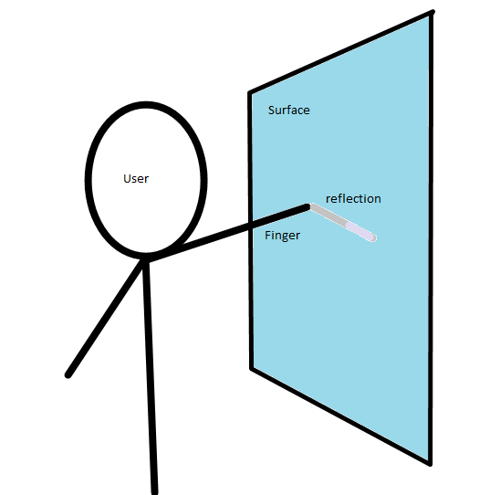
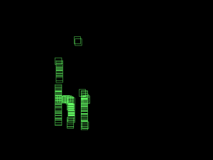
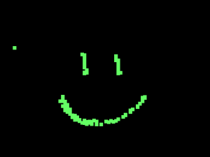
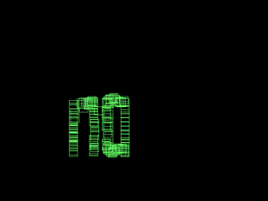

So Mirrortouch is really nice, it's quite accurate, very fast, quite cheap and it's my idea :)

But while trying to hook up the script to my webcam and looking at the live webcam feeds from it pointing at my monitor (aside from the awesome infinite-mirror effect!) I discovered an effect that's quite painfully obvious but dismissed earlier: reflection.

So a few months ago, I just sat in the dark with a few flashlights and a 6in square block of acrylic. I explored the multitouch technologies with them. Shining the flashlight through the side, I can replicate the FTIR (Frustrated Total Internal Reflection) effect used in almost all multitouch systems. Looking from under, with a sheet of paper over and shining the flashlight up, I can experiment with Rear DI (Diffused Illumination). Shining it from the side but above the surface, I can see the principle of LLP Laser Light Plane, actually here, it's more accurately like LED-LP). MirrorTouch is from looking at it with one end tilted torward a mirror.

If you look at a mirror, and look at it not directly on, but at an angle, however slight, you can notice that the reflection (or shadow, or virtual image whatever you want to call it) only appears comes in "contact" with the real image (the finger) when the finger is in physical contact with the reflective medium. From the diagram below, you can see the essence of the effect. When there is a touch, the reflection is to the immediate right (in this camera positioning) of the finger. If the reflection is not to the immediate right, then it is not a touch.

It's a very very simple concept, but I disregarded it because real monitors aren't that shiny. But when I hooked the webcam up to the monitor, it turns out it is. I have a matte display, and it's actually really shiny from a moderately extreme angle.

So I hacked the MirrorTouch code quite a bit and I have something new: ShinyTouch (for the lack of a better name). ShinyTouch takes the dream of MirrorTouch one step further by reducing setup time to practically nothing. Other than the basic unmodified webcam, it takes absolutely nothing. No mirrors, no powered light sources, no lasers, speakers, batteries, bluetooth, wiimotes, microphones, acrylic, switches, silicon, colored tape, vellum, paper, tape, glue, soldering, LEDs, light bulbs, bandpass filters, none of that. Just mount your camera at whatever looks nice and run the software.

And for those who don't really pay attention, this is more than finger tracking. A simple method of detecting the position of your fingers with no knowledge of the depth is not at all easy to use. The Wiimote method and the colored-tape methods are basically this.

The sheer simplicity of the hardware component is what really makes the design attractive. However, there is a cost. It's not multitouch capable (actually it is, but the occlusion that it suffers from will deny the ability for any commonly used multitouch gestures). It's slower than MirrorTouch. It doesn't work very well in super bright environments and it needs calibration.

Calibration is at current stages of development, excruciatingly complicated. However, it can be simplified to be quite simple in comparison. The current one involves painful color value extraction manually from an image editor of your choice. Then it needs to run and you need to fix the color diff ranges. Before that you need to do a 4-click monitor calibration (which could theoretically be eliminated). But it could be reduced by making the camera detect a certain color pattern from the monitor to find out the corners and totally remove the 4 point clicking calibration. After that, the screen could ask you to click a certain box on the screen which would be captured pre-touch and post-touch and diff'd to get a finger RGB range. From that point, the user would be asked to follow a point as it moves around the the monitor to gather a color reflection diff range.

The current algorithm is quite awesome. It searches the grid pixel-by-pixel scanning horizontally from the right to the left (not left to right). Once it finds a row of 3 pixel matches for the finger color, it stops parsing and records the point and passes it over to the reflection analysis program. There are/were 3 ways to search for the reflection. The first one I made is a simple diff between the reflection and the surrounding. It finds the difference between the color of the point immediately to the right and the point to the top-right of the finger. The idea is that if there is no reflection, then the colors should basically roughly match and if it's not then you can roughly determine that it is a touch.

This was later superseded by something that calculates the average of the color of the pixel on the top-right of the finger and the color of the finger. The average should theoretically equate the color of the reflection, so it diffs the averaged color with the color to the immediate right (the hypothetical reflection) and compares them.

There was another algorithm that is really simple for when it's very very bright (near a window or something) and the reflection is totally overshadowed (pardon the pun, it wasn't really intended) by the finger's shadow. So instead of looking for a reflection, it looks for a shadow, which the agorithm thinks of as just a dark patch (color below a certain threshold). That one is obvoiusly the simples, and not really reliable either.

One big issue is that currently, the ranges are global, but in practice, the ranges need to vary for individual sections of the screen. So the next feature that should be implemented is dividing the context into several sections of the screen each with their own color ranges. It's a bit more complex than the current system but totally feasable.

So the current program has the ability to function as a crude paint program and some sample images are on the bottom portion of this post.

