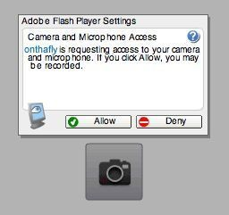

One potential I see for shinytouch is the ability for it to be embedded in a flash application which can be embedded into a web page. Then there could be a web 2.0 style JS API for awesome canvas tag based creations. Or it could just be used to interact with another flash application or game.
The reason why this is more likely able to be used as such is because setup for this is so easy that this could actually convince people to do it. With other systems you really have to convince people really well to be dedicated enough to set up the hardware whatever it is. At that point, the software is the easy part and the audience is more than glad to go through the hassle of downloading, running, configuring, and maybe even compiling.
But with shinytouch aiming at a different, larger and overall lazier (myself included in this group) audience. This means that it is really important to lower the entry barrier to the lowest possible level. I think being able to just move the webcam a little bit, go to a website and follow simple directions to use their own touchscreen is a very potentially attractive concept. It could even spawn more interest in the touchscreen, natural user interface communities.
This is really what I want he project to end up like. It seems quite practical to me. How do you feel about this?

(note that this is my second post entirely from my iPhone)
