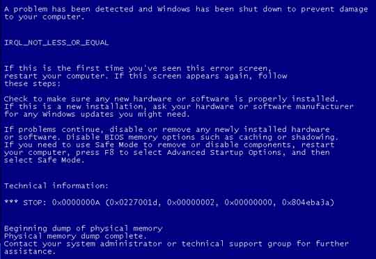
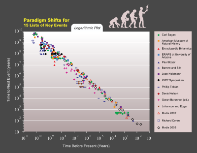
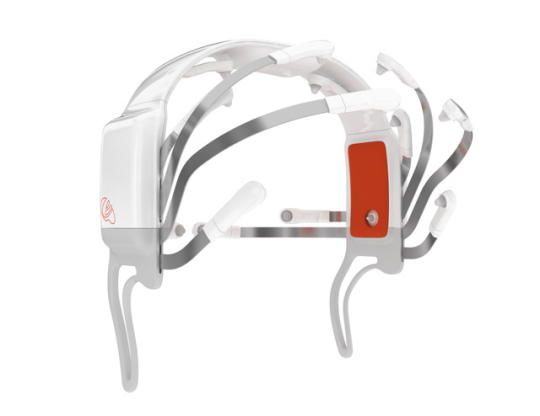

So about 2 Months ago I realized something quite interesting. It is that digital communication is creating new paradigm shifts (if I may call them that without all singularity theorists attacking me) in the order of the evolution of human communications - backwards.

What? How is progress backwards? Well, think about it, just about the first type of digital communication was through text (computing may have existed prior to that using buttons and switches which could be argued, but I'm going to say that they weren't real communication methods but rather just computing methods). Text, is written language and historically, written language is quite a recent invention. I may be thinking of telegrams or maybe I could just start with computer communication, but the point remains.
What's next? Well, after telegrams, people invented telephone, the logical successor. After the book was invented the radio. Even before text was totally phased out from computers, sound was there (this part is a assumption because you might have realized my age so I was never alive before the era of GUIs and Windows 95). But if you think of it, human written language was preceded by spoken language. You can see evidence even today with many developing countries having illiterate people. That usually means they don't write but can speak.
Preceding human speech is gestures and behaviors. Like recognizing that a tiger is chasing you, and running and having others interpret the message as: "hmm.. I should run too...". These gestures, albeit historically primitive have not been captured in digital communications technology until the development of video. This development happened after the development of telephones. It is now the focus of things like YouTube and Skype. Quite recent advancements in technology that is just now being implemented. Gestures aren't now just being developed in the form of video but also the cool natural user interfaces (again, natural not just because they feel natural to the user, but primitive data formats with less technology, ironically implemented with technology). Multi Touch, 3d tracking and gesture recognition are big in the news today; the Wii, Natal, Jeff Han, Surface, FTIR, DI,  LaserTouch, LLP, PS3 eye (LOL my iPhone just autocorrected that as "pee") and I couldn't leave out a plug for my ideas, ShinyTouch and MirrorTouch.

This isn't some magical scheme of such to prove some error sort of divine creationism. No, this is a quite logical example of how human evolution interacts with technology, a world governed by Moore's law (or something else like Kurzweil's law since Gordon Moore might not want to be associated with everything suffering from exponential growth). Technology is built around the limitations of the age. One of the original a d ongoing issues is bandwidth. Text uses only 8 bits per character. Sound requires several hundred kilobits per second. Video requires an exponential leap with something  like 32 bits times 640 times 480 times 30 bits of data per second. I don't have a calculator now but you can quite easily understand how 32*640*480*30 is big. _I've now calculated it to be somewhere around 211,968,000 bits per second, and that's quite a bit bigger than audio._ So it's just that humans logically evolve more efficient and dense formats of communication, while digital technology just reduces bottlenecks and enable for the more primitive yet more data intensive communication systems to be implemented.
Now for what's interesting: the future. Now that we know the pattern of communication progresses backwards, what predates gestures? Well, I think it's obvious, but never really been in reach of exploiting it directly. It's never even itself been use as a communication substrate. And extrapolating the rest of the above noted correlations, it fits as something that requires unprecedented large bandwidth and computing. It's more natural than anything else because it is moreso innate than learned. It's thing that lies below all of that. It's direct thought.
Nothing comes more naturally to a human to thinking. We have evolved in recent (on the evolutionary timescale) years to have a massive ballooning of skull size, hopefully to make way for that Grey matter that goes in it. Thinking is something people do, and it's universal. Neurons are not French or German, American or British, Chinese or African, northern or southern, accented or racist, wise or dumb, experienced (they may be old, but they don't gain experience with age) or a n00b. They are just simple circuits that process and store data, passing it along in a giant, organic neural network. We are all born with them and they are always roughly alike. It is the ultimate in natural and innate thinking.

And there is evidence that it is currently being seriously considered. MRI scanning has greatly increased scanning resolution in recent years and EGG machines are now being developed further and being commercialized with companies like OCZ with their Neural Actuator or Emotiv's EPOC product. So it is likely the next and as far as I can tell, the final communication paradigm.
This is now the third blog post from my iPhone. But this time I did some editing on my computer.
