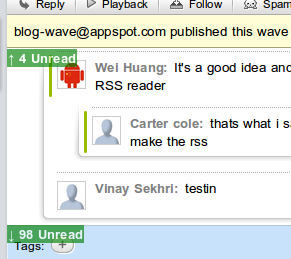

I made an extension which shows a green sign (like gmail) on the side whenever there are blips outside the viewport. It allows you to quickly and effectively use keyboard navigation without blindly checking above and below, or generally scroll without needing to guess the position.

It comes as a [Chrome Extension](https://chrome.google.com/extensions/detail/jncflgepcddhcejhofdojlkjgjhcfmpc) and also as a [Greasemonkey Userscript](http://antimatter15.com/misc/wave/wavenavigation.user.js).
