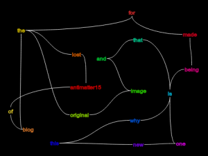

Word Association is a nice little game where you associate the word above yours to some other word. I felt like making it a sort of net where any part could connect to any other and associate a word from any point to another point.

I think it would be an interesting collaborative gadget on Google Wave but I have no idea how to implement it (well I sorta do but I dont know what's the best way).

[http://antimatter15.com/misc/wordassoc/graffle.html](http://antimatter15.com/misc/wordassoc/graffle.html)

You can double-click on any element to associate something to it, if you type the same thing as another element, it links from each other.
