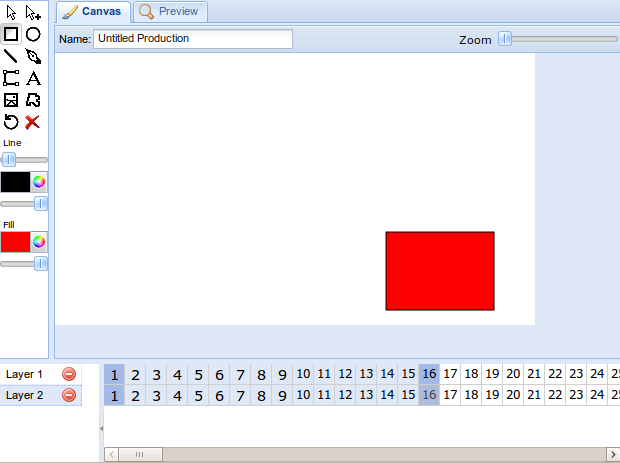

The name field will be replaced with buttons, and zoom may or may not be scrapped. Since gadgets only take up a fraction of the page (usually) it's designed with size in mind, which may help on other space-constrained devices like netbooks.

It may have a cool feature like VectorEditor's demo where you can draw off the canvas area.

As for why the tabs are now on top and the timeline is on the bottom, there's no reason, I just think that that layout is more aesthetic.

And I might name it something other than the ajax animator, something just like Animator or something
