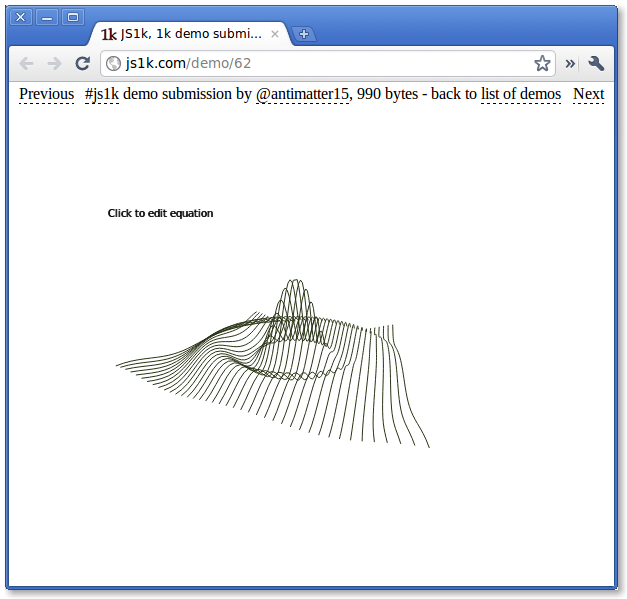

Interestingly, it does seem that a lot of the[ demos for the js1k](http://js1k.com/demos) competition are a whole lot more impressive than the [10k competition](http://10k.aneventapart.com/). Despite that js1k started with no prizes and 10k has a collective $10,000 worth of prizes. [Though](http://js1k.com/demo/4) [I](http://js1k.com/demo/19) [do](http://js1k.com/demo/47) [have](http://js1k.com/demo/62) [several](http://js1k.com/demo/62) [entries](http://10k.aneventapart.com/Entry/46) on [both](http://10k.aneventapart.com/Entry/18). Anyway, this is the continuation of [my old 3d function](2010/05/simple-javascript-3d-function-plotter/) plotter, but that one doesn't work anymore because i'm evil and hotlinked the  github repo and three.js updated in an api-breaking way.

Anyway, after you vote up [http://10k.aneventapart.com/Entry/46](http://10k.aneventapart.com/Entry/46) and [http://10k.aneventapart.com/Entry/18](http://10k.aneventapart.com/Entry/18) you should totally try out my 3d function plotter at [http://js1k.com/demo/62](http://js1k.com/demo/62)
