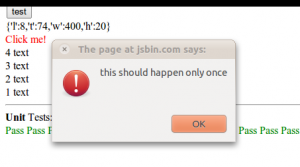

vX was an old project which aimed to do lots of nifty things in the least code possible (3KB without gzip!), but among its goals, developer friendliness wasn't present. So now, I made a new library, this one is 5KB before gzip, and supports most of what vX does, but with DOM manipulation as well, in a jquery-like manner, and animations with queuing and easing. The new library (which doesn't yet have a name) aims to be really lightweight (which really doesn't matter much), while being more developer friendly.

For example, I can select all elements with the class "test" using _.cls("test"), and make them purple by doing _.cls("test").css("color","purple") similar to jQuery. I can do _.id("yay").load("lib.js") to load something using ajax. Creating elements is pretty easy too, say I want to load a random script, I can do _.create("script").attr("src","url").appendTo(_.tag("body")) and I can add events to something using _.tag("button").index(0).on("click",function(e){alert("yay")}).

Here's a nice little demo of what it can do [http://jsbin.com/owuge/31](http://jsbin.com/owuge/31)

I intended to post this back in March 7th, but I was working on a rewrite of the library, which would be a tiny bit larger but implement CSS-selectors and be easier to maintain.
