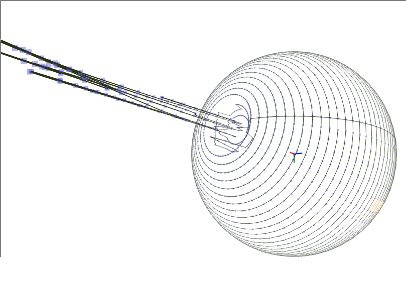
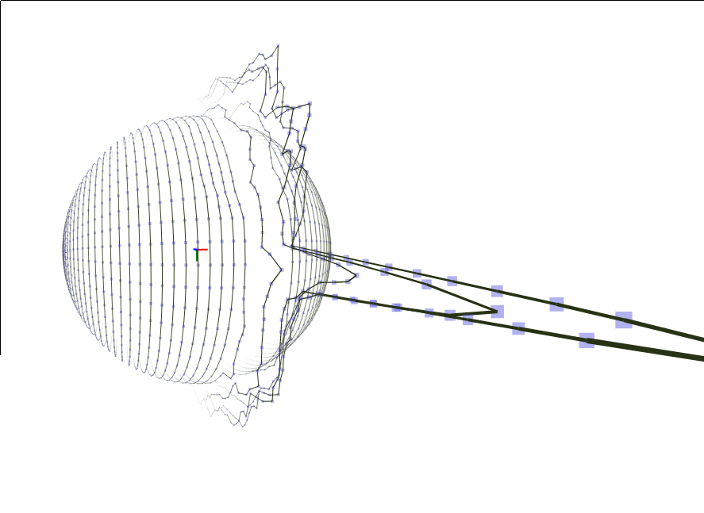

So for the  past few days, I discovered this neat app called [Sculptris](http://www.sculptris.com/). It's this amazing [digital sculpting](http://en.wikipedia.org/wiki/Digital_sculpting) app where your canvas is basically a blob of virtual clay that can be molded into any shape with any level of detail. It's windows-only, and I thought it would be neat to have something like it that works in the browser. First I thought of using WebGL, but trying to start chromium with webgl always ends up with a GLXFBConfig error, and on Firefox, it's stuck with using libosmesa which gives absolutely terrible framerates (IDK why but Fx4 *crawls* on my computer. Panorama is so slow it lags from simple dragging). Eventually, I ended up basing it off my js1k function plotter, because it's a fairly simple 3d renderer.

The pictures on the top of the page are of [the death star](http://en.wikipedia.org/wiki/Death_Star) and [alderaan](http://en.wikipedia.org/wiki/Alderaan), respectively, mostly because planets (and moons that aren't moons) are mostly spherical and explosions and light rays are pretty much the only things that this app is suitable for at these stages.

So how does it work? It's actually really simple, and probably too simple. At ~300 LOC  of pretty trivial JS, it's not much at all (though it is hideous, I must warn you). It is based on my js1k entry, and I considered making this a 1k submission, but I gave up and said I couldn't. It starts off simple enough, do lots of freaky trigonometric loops to generate a set of points that lie on a sphere. Then loop through every 50 milliseconds, apply a 3d transformation, get points that lie within a radius of the mouse position and reference them in the selected array. Then you segregate the selected array into the foreground and background, find the arithmetic mean of the fg and bg, respectively and find the difference. Then I convert it to spherical coordinates and get rid of the ratio to ignore the magnitude of the vector and add it to the position of foreground points. Then loop through all the points and wherever there's a long distance, insert a new dot at the midpoint.

For no apparent reason I decided not to put many words on it. I was actually reluctant to add "points" and "undo", but it's fine print in faded color that doesn't help the user at all.

*   Middle Click + Drag to rotate (in 3d)
*   Right Drag to deflate the shape
*   Left Drag to inflate the shape
*   Middle Scroll to zoom in/out
*   The slider bar is for controlling the size of the selection.
*   The checkbox enables/disables Undo/Redo (via CtrlZ/CtrlY or CtrlZ/Ctrl+Shift+Z).
App: [http://antimatter15.github.com/3d-sculpt/3d.html](http://antimatter15.github.com/3d-sculpt/3d.html)

Mirrored Version: [http://antimatter15.github.com/3d-sculpt/mirror.html](http://antimatter15.github.com/3d-sculpt/mirror.html)

(Not as in the other meaning for mirror, but it actually reflects the X axis so that it's symmetrical, which is a neat feature in sculptris)

Github: [http://github.com/antimatter15/3d-sculpt](http://github.com/antimatter15/3d-sculpt)
