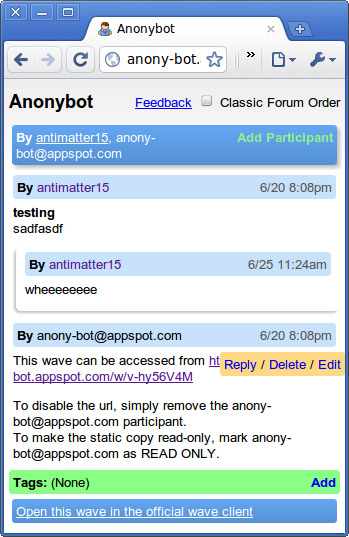
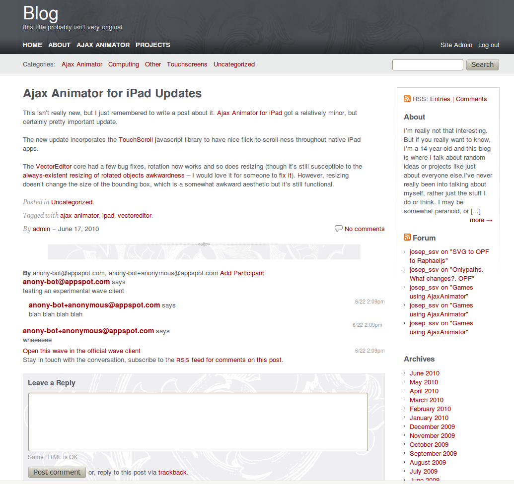

[Anonybot](https://wave.google.com/wave/waveref/googlewave.com/w+ank0T7ZkwZ/~/conv+root/b+ank0T7Zkwa ) is something that might notice looks eerily like microwave which eerily looks like Wave Reader. It also notably looks _exactly_ like the current version of static-bot. That's because it _is_ static-bot, just renamed with a focus on **anonymous posting**. It supports anonymous addition of tags,** replying, deleting, and editing** as well as adding participants. It **renders everything **_almost_ perfectly, because I have yet to find a rendering flaw - gadgets do not render for the same reason as microwave (speed + I hate the Wave Reader hacky solution + google's solution doesn't work yet).

It's really quite simple to use. To allow the bot to access stuff, just add **anony-bot@appspot.com** as a participant. It'll make a reply with a link to the public URL. The URL isn't cached or placed in any list, so unless you link to it, nobody can find it, however it is based on the wave ID, so if the wave ID is known, so is the static copy.

**Access controls** couldn't be easier. Mark the bot as read-only to make the Anonybot version read only or delete the bot to disable the URL.

So that's the first part of this post. The second is arguably more exciting.

The **Wave Embed API** is pretty great. Its pretty easy to use. But it also has one pretty big disadvantage: there is no theme integration whatsoever. I'm experimenting with a new wave embed system, built upon the Anonybot and Microwave architecture which will allow **deep theme integration**. So here's the basic idea: You add the code to your theme, it automatically posts the content of the post to wave and creates a public wave for it, allows people to comment, links to the full wave client so people can follow the comments, and allows people on wave to discover your post and get to your site.

I'm not a designer, so the integration still sucks, but that's the proof-of-concept using a few lines of configuration JS and a little CSS. Here's the [longer writeup](http://anony-bot.appspot.com/w/jGsOO3yUA) of the experimental version. You can [try it out here](http://antimatter15.com/misc/waveembed.html). I'm probably going to rewrite it to use less globals soon if people are interested (please comment here if you are).  Please refer to the [newer post on the topic.](2010/06/wave-embed-api/)
