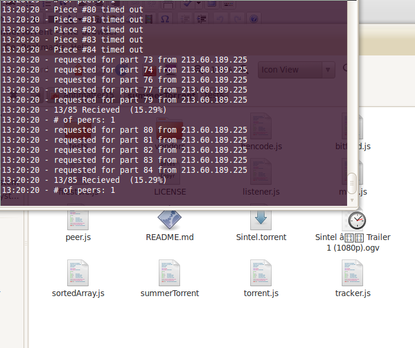

A few months ago[ I tried to make a bittorrent client in javascript](http://github.com/antimatter15/jstorrent). But a few days after it started, I found out that there were already other projects with the same goal. The most complete of them was summerTorrent. However, though (I thought) it was so insanely close, it wasn't finished. So anyway, I made a few changes that at least made basic torrenting functionality working.

[summerTorrent](http://github.com/antimatter15/summerTorrent)
