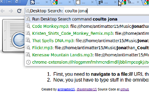

I felt like making some chrome extensions recently. so this is a almost totally useless one, since it uses the experimental APIs. Basically, since the new versions of chrome let you have content scripts that act off file:/// urls, you can make a script that indexes the local files and store it to a searchable index, as I have done. Plus, there's a new omnibox api, so you can use that to search too.

Probably won't work for anyone. but anyway, feel free to[ fork it on github.](http://github.com/antimatter15/chromesearch)
