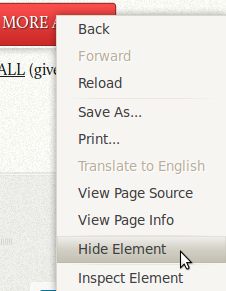

[https://chrome.google.com/extensions/detail/omjoegfimgdcgigodfpnjefanhfiagae](https://chrome.google.com/extensions/detail/omjoegfimgdcgigodfpnjefanhfiagae)

It's a simple extension that uses the new chrome context menu API to gain DOM access to hide an element. It's actually a lot more complicated than it should be since, probably chrome's multi-process architecture makes it impossible to actually pass the DOM over, so instead you have to create a content script that listens and logs all click events and when a context menu action is triggered, you send a message to the content script which applies an action to the selected DOM node.

Anyway. Code here. [http://github.com/antimatter15/hideelements](http://github.com/antimatter15/hideelements)
