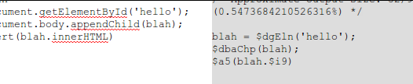

There's lots of compression systems for JS out there. There's the really smart JS rewriter magical rhino-based ones like Closure and YUI. There's the string-based ones, packer base62, huffman, and lz77\. But of the latter category, they all rely on a sort of dictionary coder, where the dictionary (or huffman tree) needs to be sent alongside the compressed content.

Unlike strings of bits, javascript code often refers to methods on the document object model. If we were to crawl the DOM, we could get a list of DOM properties and use that as the shared dictionary which doesn't need to be changed, sent or stored. Ever.

Example:

document.getElementById -&gt; $dgEln

document.body.appendChild(s); -&gt; $dbaChp(s);

And as the dictionary never needs to be stored, it's dynamically computed based on the default browser DOM, there is a constant overhead for the indexer. The dictionary does not change size based on the size of the content.

The first prototype relied on recursively indexing properties 2-3 levels from window using the ES5 Object.getOwnPropertyNames.  That feature is only supported on IE9, Chrome 6, probably the latest versions of Safari and Firefox 4\. As such, it severely limits the applicability of the algorithm.

Version two switches it to a simple for..in loop. The problem here is that it's no loner possible to index certain things. Properties like Math, which are marked DontEnum internally can not be iterated, and thus can not be compressed (Math.cos would have been $Mac8). However, it probably makes up for this by recursively indexing things substrings of the discovered objects. So document.getElementById would be interpreted as the full document.getElementById instead of seperately compressing document and getElementById. It also uses a new hash function which makes the output more readable and the length proportional to the length of the source. length becomes $l6 document.body.removeChild becomes $dbrChp. However, this also removes the possibility of that nice fallback on things not supported by the browser. (if(document.getElementsByClassName){}else{} would have been translated as d3k2.s93k and back as document.s93k on browsers that dont support it and so browser detection gracefully degrades without blah is not defined errors).

Overall. What is the compression ratio? Not that great. If you do lots and lots of DOM access then you might get a decent ratio, but the code is slow and the ratios are relatively insignificant.

Minify: [http://antimatter15.com/misc/js-minify/minify.html](http://antimatter15.com/misc/js-minify/minify.html)

Maxify (decoder): [http://antimatter15.com/misc/js-minify/maxify.html](http://antimatter15.com/misc/js-minify/maxify.html)

