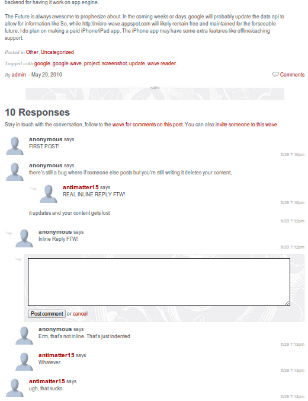
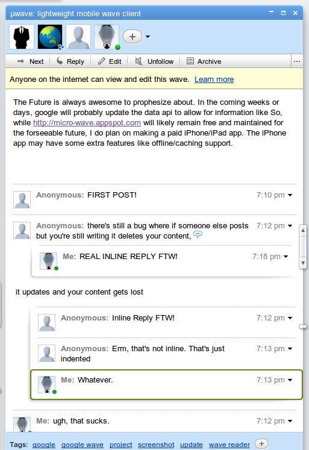

Can you tell that the screenshot on the left is actually an embedded wave? Probably not.

First, a little overview on what this is. A lot of people are interested in using Google Wave as a commenting system, however the **official embed api at the current state suffers from several shortfalls**. It's tedious to operate a wave-integrated commenting system. As an author, you have to **manually create a wave for every post**, copy the content over to the wave, get the wave ID, and paste it into your template. Every time you change your post, you have to yet again manually sync the page with wave. Once you've gotten the wave into the page, the embedded wave itself has a few issues. You **can't style it using CSS**, and you can only change the background color and font. The width can't adjust to the width of your page after the initial load. There's no way to get rid of or change the style of the** huge blue border** around it. It** forces it's own scroll bar** which looks nothing like anything else on the page and **prevents intuitive navigation** of comments using the same scrollbar as the rest of the page. Lastly, there's no way for anonymous readers to comment on the post.

For each of these issues,** the new w2_embed api offers a solution**. Instead of using iframes to hack another page onto the current one, this one is built into the page, injecting elements directly onto the page's DOM. These** elements can be styled in nearly any imaginable way through CSS and HTML**. The sandboxed and namespaced single-function API allows for multiple waves on one page with less than 10KB of JS overhead (Compare to about 1.4 megabytes). Instead of relying on a special Wave ID, the app uses a centralized and remotely stored database which associates any identifier you provide with functional wave IDs. That means, that instead of using a string like `googlewave.com!w+Blsm0RMW_A`, you have the URL of your blog, say `2010/06/wave-embed-api`. Not only that, but it can **automatically pull the title of your wave, the authors, the permalink and tags from the post, automatically create a wave from that with the same tags and title with the content automatically set as the root blip as well as a permalink back to the blog post**. When viewed from wave, the user can follow, unfollow, search and find waves using the exact same familiar interface. On your blog, you can make the wave backend entirely seamless and subtle. Since it's built on top of Anonybot**, people can reply blips without having google wave** accounts right from your blog.

It's all part of a new embed API built upon Anony-bot (which itself is built upon microwave, which is built on wave reader, which is built upon the prototype python desktop client... Someone should make a wordpress plugin for this to make this family history even longer).

The[ last post noted the beginning of this project,](2010/06/anony-bot-embed-api/) and here is part two. The API has been cleaned up a lot. The code has been simplified. Features added and design changed.

The major change is a total decoupling of it and the mainline Anonybot codebase. There are some major implications of the change. In the original prototype of the API, it still had the iconic blip context menu inherited from microwave. That's gone. So is the participants bar, link to real wave client, blip html, blip content, reply box, and everything. There are now no required or automatically added html/dom elements. Everything is specified through a **simple HTML templating engine**. Since the code isn't shared, changes from each individual project now on probably won't be instantly applied to both. This has advantages and disadvantages. On the plus side, is that changes to anonybot won't break the embed api. However, bug fixes on one may not propagate to the other.  The code can be much smaller since features like search, which was previously hidden, can now be totally removed. Also, since it's been rewritten from scratch as an embed api, it no longer exposes any extra globals and multiple embeds can be done for each page.

The biggest change is the templating engine. Before, it only worked with the blip design, but now it's totally integral to every aspect of the interface. Lets walk through the basics of the API, starting with a minimal example.

All the content is wrapped in a huge hidden `div`, and inside is one element with the `wavebody` class. That huge wave is the scope of the templating engine. That means that if you put `{{1+1}}` anywhere inside the `div`, it'll show up as 2\. Place it anywhere outside the div, and it shows up as `{{1+1}}`. Simple, right? The `wavebody` element is where the actual blips will go. But since there aren't any blips beforehand, `wavebody` is filled with the template for a single blip. The content gets multiplied several times and that makes the wave. The template scheme is really simple. Basically, you just wrap arbitrary JS code within `{{` and `}}`. The code gets executed (in the scope of the wave) and the block gets replaced with the return value of the script. When you're inside `wavebody` there are a few additional blip-specific things that you can add. Now we have to learn the magical snippets of code you can use inside the curly brackets. One of the objects exposed to the templates is `wave`. The nice thing is that it mirrors [the wave api](http://code.google.com/apis/wave/extensions/robots/protocol.html#Wavelets). So the wave object exposes the following attributes (copied from the google page).

*   `creationTime` denotes the [Unix time](http://en.wikipedia.org/wiki/Unix_time) at which this wavelet was created.
*   `creator` denotes the address of the participant who created this wavelet.
*   `lastModifiedTime` denotes the [Unix time](http://en.wikipedia.org/wiki/Unix_time) at which the wavelet was last modified by any participant.
*   `participants` contains an array of participant IDs for all participants on the wave.
*   `rootBlipId` contains the Blip ID of the root blip.
*   `title` contains the title of the wavelet, which by default consists of the first line of text up to the first carriage return.
*   `version` contains the version of this wavelet. Each atomic operation on a wavelet increases this version number.
*   `waveId` contains the Wave ID of this wavelet.
*   `waveletId` contains the wavelet ID of this wavelet. Note that for waves which contain only one wavelet (that don't have private conversations, in other words), this wavelet ID is usually of the form `conv+root` indicating that the wavelet is identical to the conversation root, the root wave.
*   `dataDocuments` contains a dictionary (associated array) of the IDs and data of any data documents attached to this wavelet.

In addition, there are a few non-standard components.

*   `permalink` contains a link to the waveref which points to the specific wave on the real wave client
*   `blips` contains a js object (similar to a hash or dictionary) of blipIDs associated to blip objects
*   `bliparr` contains an array of blip ids in no particular order, most frequently used for getting the number of replies in a conversation in `{{wave.bliparr.length-1}}`

There are also some functions you can call. For example, `wave.creationTime` is in the form of a unix timestamp. That probably isn't too useful to an ordinary user, so a `format_time` function is there to format it like "6/30 10:45am". If you want to have some other custom datetime format, get me a script to do it in javascript in less than 500 bytes and I'll include it in the next version.

*   `format_time(int)` Format a unix-style date as a human-readable "6/30 10:45am" or if you prefer "m/d h:MMtt"
*   `render(blip)` Render a blip and return the HTML. Most of the time, it's unnecessary as there's a blip.html attribute

There are a few actions that you can do. Certain strings like `{{addparticipant}}` can be used in `onclick=` attributes to trigger certain actions on various events.

Here you see a link and a button. The link has been configured to prompt the user for a participant ID to add when clicked, and the button was set to prompt the user for a tag to add when clicked. There are several such actions.

*   `addparticipant` Prompt the suer for a wave address to add to the wave
*   `reload` Reload the current wave
*   `addtag` Prompt the user for a tag to add
*   `setname` Prompt the user to set a username for posting
There is also the user list. It comes in two flavors, `{{participantlist}}` and `{{contributorlist}}`. The latter only works when inside a blip scope (the stuff inside `wavebody`). They're special because they're actually interactive. When the list is long, it shortens it and creates a link to expand.

*   `participantlist` A list made from wave.participants
*   `contributorlist` Only works when in `wavebody`, a simple users list made from blip.contributors
Now, is finally the stuff that goes in the blip. Like `wave` it extends some wave api features, so I'll start with[ pasting what google has documented](http://code.google.com/apis/wave/extensions/robots/protocol.html#Blips).

*   `blipId` contains the ID of blip in which the event occurred.
*   `childBlipIds` contains an array of blip IDs for each of the blip's children.
*   `contributors` denotes participants who have contributed to the state of this blip.
*   `creator` denotes the participant who created this blip.
*   `lastModifiedTime` denotes the [Unix time](http://en.wikipedia.org/wiki/Unix_time) at which this blip was last modified by any participant.
*   `content` contains the textual content of this blip.
*   `version` contains the version of this blip. Each atomic operation on a blip increases this version number.
*   `waveId` contains the Wave ID associated with this blip.
*   `waveletId` contains the wavelet ID associated with this blip. Note that for waves which contain only one wavelet (that don't have private conversations, in other words), this wavelet ID is usually of the form `conv+root` indicating that the wavelet is identical to the conversation root, the root wave.
There are a few additional methods which, again are non-standard.

*   `permalink` contains a link to the waveref which points to the specific blip on the real wave client
*   `html` contains a string of the rendered (with formatting and annotations applied) content
There are also actions, similar to the global `addparticipant`, `reload` and `setname` actions. They can still be used within `wavebody` but there are some actions which can _only_ work in the blip template.

*   `edit` Add an edit box immediately below the blip, pre-populated with the text content of the blip
*   `remove` Remove the blip, it will first issue a confirmation prompt to the user
*   `reply` Add a reply box immediately below the blip. If there is already a blip below, the reply box is indented.
Below is a little example showing how to use the `blip` object.
Lastly is the JS part. Without it, nothing would ever show up. You need to include the currently 6.5KB JS library from `http://anony-bot.appspot.com/assets/embed2.mini.js`. After that, you need a separate script tag anywhere after the big hidden super element. It _must_ be outside the super element (unimaginable evils will happen if it isn't). Inside that script tag needs to be a function call to `w2_embed`. The first (and only) argument has to be a JS object with at least the `element` key pointing to a DOM element which contains an element with the class `wavebody`. There are _lots_ of other config options, and here they are.

*   `element` (Required) a dom element which contains a div with the "wavebody" class
*   `identifier` The identifier for the wave that the server will use to generate a wave ID from, default: location.pathname
*   `root_title` If the identifier has not previously been associated with a wave ID, the wave will be created with the specified title. default: (no title)
*   `root_content` If the identifier has not previously been associated with a wave ID, the wave will be created with the specified content as the root blip. default: (no content)
*   `participants` The participants the wave should be created with if not previously associated with a wave ID, default: [], suggested: ['public@a.gwave.com']
*   `hideroot` Boolean whether or not to not render the root blip
*   `edit` A reference to a DOM element which can be templated into the edit box, should contain handlers for the actions {{submit}} and {{cancel}} as well as a textarea with the class "wavetext"
*   `tags` Set of tags to be added to the wave if the identifier has not previously been associated with a wave and must be created.
*   `api_root` The domain containing the server component (proxy and dictionary server). Default: anony-bot.appspot.com
*   `gadgets` Enable native gadgets (does not work)
*   `render_state` Display the user a gadget state
*   `chronological` Render blips chronologically (see Microwave's "Classic Forum Layout" option)
*   `json_url` Location of JSON implementation to be loaded dynamically in case it's not native to the browser default: http://anony-bot.appspot.com/assets/json2.mini.js
*   `waveid` Skip the identifier lookup and directly reference a wave by it's id
&nbsp;

You can see that the function call was saved to a variable named `demo`. That's useful because you can use that to reference later to manipulate things. The return of a w2_embed call is a JS object with the following keys.

*   `config` A reference to the initial config object
*   `reply(text)` Create a root-level reply
*   `reload()` Reload the wave.
So lets try putting everything together.

&nbsp;

Afterthoughts: Just a little thing to add at the end. You can can create a a div with the class `waveedit` as used above. It's not strictly necessary, but it lets you customize things a bit more. You also need a CSS style for .wavethread with a padding-left (or margin-left) in order for threads to show up properly. Blips are automatically given a .waveblip class.

That screenshot on the top of the post, [if you want to try it out. It's here](http://anony-bot.appspot.com/assets/test2.html).

I'm not making any money off of this, so there's no reason for me to hide the fallibilities of this solution from anyone. This, like any other solution is not perfect. There is no true wave-style real-time editing, it uses polling. It does however update every 10 seconds if it's configured to do so using the `poll_updates: true` configuration option. It can't ever really do much better, since app engine doesn't yet support pushing out real time data to attached clients, even though they announced the neat Channel API (still waiting to use it!) at I/O. Either way, that probably won't help too much as w2_embed uses JSONP for client/server communication across multiple domains, and it's unlikely that the channel api will allow for that. Also, since there's no way to fetch a single blip, the user must request the entire wave to check the tiny 32 bit version integer if it's been incremented, and if it has, then the whole wave has to be fetched again. It's by no means efficient, and so my server would be very very sad if the polling interval was significantly increased. It's not very SEO friendly. Though it's not always that people want the comments to be indexed by search engines, so some people may care less. Accessibility-wise, it shouldn't be too horrible if the screen reader/browser supports javascript and hugely depends on the HTML being used in conjunction with the script.

As of date, this was my longest blog post ever, and I would be sad if nobody commented (ironically using my non-wave-based commenting system). And I'm not posting my source code unless someone comments, so, an incentive :P
