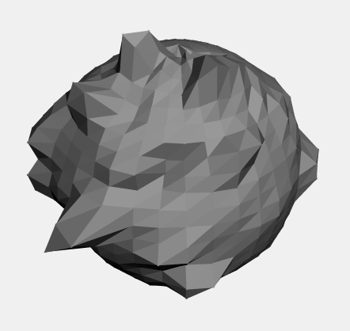

The above testament to my artistic ability, or specifically my lack thereof, was made in my experiment with digital sculpting, [technically, part II](2010/09/3d-sculpting-tool/). Wikipedia says
> **Digital sculpting** is the use of software that offers tools to push, pull, smooth, grab, pinch or otherwise manipulate a digital object as if it were made of a real-life substance such as clay.
I saw[ this Lifehacker article ](http://lifehacker.com/5607134/sculptris-is-a-user+friendly-3d-modeling-and-sculpting-program)on sculptris a few months ago and it sort of made an impression on me of how cool and awesome 3d was. Any real program is of course much different and better than this one because of the ability to actually grab, smooth and pinch the digital object.
