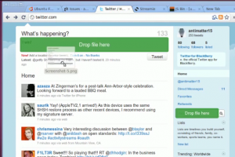

I'm making a (really awesome) chrome extension that involves dragging and dropping files. MDC, as [usual](http://promotejs.com/), has great [information](https://developer.mozilla.org/En/DragDrop/DataTransfer) on the [topic](https://developer.mozilla.org/en/using_files_from_web_applications). Gmail does it almost perfectly, with the green file drop target. But all other implementations of this feature suffer from two issues, and Gmail's code is far too obfuscated for any mere mortal to interpret (no doubt thanks to closure). When implementing the file drop target, two fairly important user experience issues occur. I don't know what way Gmail does it, and I just used whatever solution worked.

Firstly, is that you only want to trigger the drop target once a file is being dragged onto the web app. You don't want a file drop target to appear once someone starts dragging text (fairly simple, check that e.dataTransfer.types includes File). Even trickier (even Gmail doesn't get this right) is dragging links also triggers the file drop target for some reason (it's tricky because then e.dataTransfer.types also includes the File type for some odd reason). There's no way to access file data as it's being dragged (getData always returns undefined). One thing that I still have no idea about is inter-browser-window data transfers.

Secondly, is how to get the dialog to dismiss itself once the dragged image is dragged out of the viewport. It's pretty tricky because of how the events bubble and don't always go through &lt;body&gt;. The solution I eventually arrived at was to add a timer on the dragleave and see if within fifty milliseconds (a random amount of time, zero works too, but fifty feels safer), another drag event is fired.

Hopefully, people will find this useful :)
