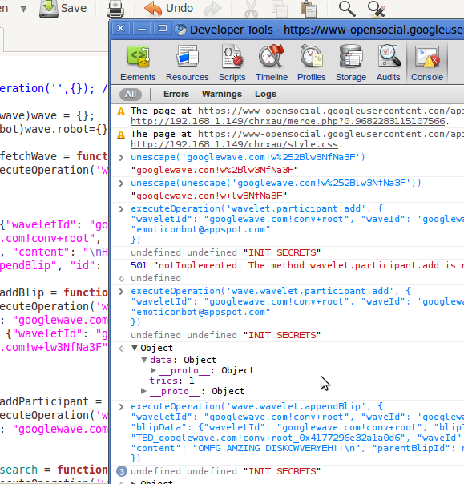

Here's something which Google has been not documenting (I daresay hiding?). There's no limit to Wave Client developers anymore. Though this wasn't documented at all, all the methods of the Active Robots API work on the new platform, as long as you prepend "wave." to the method name.

As some of you may know (or not), I'm working on a mobile wave client. Actually, I was for a while, but I never got around to make login work, so it was never really published. Then Google I/O came around last week, and suddenly my reverse-engineering efforts were sort of obsoleted by an official api (however, the official api isn't quite as awesome as my reverse-engineered code, so I may continue on that a little bit). I was downright disappointed about the new Data API after finding out that it was still read-only (except for marking a whole wave read/unread). This discovery definitely changes things.

This is taken from ops.py in the official Google Wave Robots API 2.0 (Python version, of course :P)

` `

`# Operation Types
WAVELET_APPEND_BLIP = 'wavelet.appendBlip'
WAVELET_SET_TITLE = 'wavelet.setTitle'
WAVELET_ADD_PARTICIPANT = 'wavelet.participant.add'
WAVELET_DATADOC_SET = 'wavelet.datadoc.set'
WAVELET_MODIFY_TAG = 'wavelet.modifyTag'
WAVELET_MODIFY_PARTICIPANT_ROLE = 'wavelet.modifyParticipantRole'
BLIP_CREATE_CHILD = 'blip.createChild'
BLIP_DELETE = 'blip.delete'
DOCUMENT_APPEND_MARKUP = 'document.appendMarkup'
DOCUMENT_INLINE_BLIP_INSERT = 'document.inlineBlip.insert'
DOCUMENT_MODIFY = 'document.modify'
ROBOT_CREATE_WAVELET = 'robot.createWavelet'
ROBOT_FETCH_WAVE = 'robot.fetchWave'
ROBOT_NOTIFY_CAPABILITIES_HASH = 'robot.notifyCapabilitiesHash'`

` `

Try running them in the data api and you get the awesome

501 "notImplemented: The method wavelet.participant.add is not implemented"

Hmm.. This looks bad. But then, the offically documented wave.robot.fetchWave seems an aweful lot like ROBOT_FETCH_WAVE's "robot.fetchwave" hmm, maybe it's the wave. prefix which makes all the difference. And that's exactly what does.
