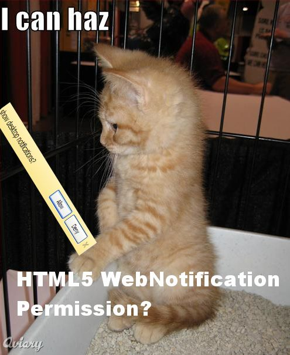

I just have an urge to draw an LOLCat every time I ever encounter something which asks for permission.

The [WebNotifications](http://dev.w3.org/2006/webapi/WebNotifications/publish/) API is one of the few things where I need to request permission.

I don't really like the API described within the spec, but I guess it suffices. Making a message aut0-dismiss is really quite convoluted, I have to use a HTML-notification and use &lt;script&gt;setTimeout(function(){window.close()},5000);&lt;/script&gt; as part of the content. Not only that, but I can't use data: urls (or at least in the Chrome implementation, which may be a bug). Unless I'm missing something huge that is.

So a while ago, I made a little Twitter trends notifier with Jetpack, and why not make one in HTML5 for Chrome?

[http://antimatter15.com/misc/html5twitmon.html](http://antimatter15.com/misc/html5twitmon.html)

Usage:

- Click the kitteh to grant permission for notifications

- Wait a bit and some updates will happen. It's ideally a "background" or "pinned" tab.

Note, that at time of writing, it's using the webkitNotifications object, which is likely only supported by webkit, and as far as I'm aware, the only UA implementing it is Chrome.

Technical details:

It uses localStorage, WebNotifications, Native JSON, and Array.filter, JSONP. Since for some reason I can't get it to work with data: urls, I used a sort of proxy, http://anti15.welfarehost.com/jshtmlwrite.html#&lt;stuff here&gt; which contains the code:
`
document.write(unescape(location.hash.substr(1)));
`
