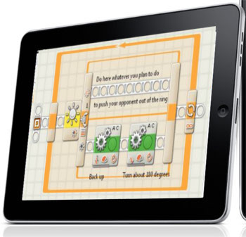

I don't have an iPad, nor is it #1 on my wish list (It mostly means any tablet platform but since none of the other ones are really recognizable, I'm jumping on the [4-letter apple produc](http://www.apple.com/ipad/)t bandwagon). But I am fascinated by touchscreens.

I started programming when I was 7 when I got my first [Lego Mindstorms RIS/RCX 2.0](http://www.amazon.com/LEGO-Mindstorms-Robotics-Invention-System/dp/B00005R6ZI) kit (and I loved the 13+ sticker on the box back then :P). So I've always had a fondness for [the platform](ris-programming.jpg), it's really great for getting kids into robotics and engineering. Kudos to Lego.

Recently, I've played around with the current rendition of the Mindstorms platform, the NXT. It's an evolutionary advancement for the platform and maintains the original intuition of the system while catering to those who don't really grow out of the original system.

The interface is, a very kid-friendly [drag-and-drop block layout](image.axd). I actually sort of like it, though it's not something which a desktop application could easily be made in. It's very procedural, and that's well suited for telling a car to explode and magically arrange red and blue balls into designated corners.

But really, where drag and drop really shines, the place where it really is _meant to be_, is on a multitouch tablet. It just makes sense. On a large multitouch surface, coding using simple finger gestures and dragging just makes sense. Lego's own Labview interface, called NXT-G has large icons and is built entirely on the dragging and dropping. Its something that just feels _right_ on a touchscreen.

The gestures need to be tailored to the specific platform, I propose that two fingers, like on a Macbook, should be used to pan around the canvas of the code. Blocks are dragged from a list on the side onto an execution path. On a block already on the canvas, touching and dragging does the logical thing: it moves the position. Touching a block on the canvas without dragging makes a pie menu type display ooze out from the block. The list would be a bunch of output "pipes" which another finger can be used to drag and link onto other blocks which display another pie menu (though only showing inputs rather than outputs) where letting go would create the connection.

Implementation-wise, one could try porting [NBC/NXC ](http://bricxcc.sourceforge.net/nbc/)(which is written in Pascal and already has the makefiles for WinCE/ARM and [FreePascal does seem to be able to compile to iPhone/iPod Touch](http://wiki.freepascal.org/iPhone/iPod_development) and the iPad should be a virtually equivalent platform). Probably something made in SVG and/or &lt;canvas&gt; could be used to create the interface which can be loaded with a [UIWebView](http://developer.apple.com/iphone/library/documentation/UIKit/Reference/UIWebView_Class/Reference/Reference.html) or using the [PhoneGap](http://phonegap.com/) platform. Then it would convert the graphical representation into some NXC code, compile it, and use the built in Bluetooth 2.1 + EDR support in an iPad to send it to the Lego NXT brick and do magic.
