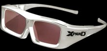

On New Years Eve, I saw the awesome movie Avatar in IMAX 3D. I noticed how there were 2 projectors (which I knew before, but seeing it is different). I started thinking about how to make 3D work better, and one of the first ideas I had was to use a polarized wheel, sort of like the fast-moving color wheels that are used in single-DMD DLP technology, but with only two states of two different polarizations. Put that over a single projector, and use the normal relatively cheap polarized glasses! After looking into it, I learned that RealD uses basically the same technology (except they have a solid state switcher thingy rather than a color wheel, which I would assume is some superior technology). So I started thinking again, and came up with "LED Inverse Shutter Glasses", which I'm nowhere near as certain about working.

LCD Shutter Glasses work by "blindfolding" one eye at a time, allowing a frame from the monitor/tv to be visible by that one eye, and alternating. This allows a different image to be sent to each eye, which our brains can assemble into a 3d image.

The shutter glasses are pretty expensive though (well, in *my* eyes (pun not intended) its insanely expensive), ranging from $100 to $200 or more.

How about inverse shutter glasses (which is a term I made up)? What if instead of darkening one eye, you add light through a side-mounted white LED? Radioshack sells White LEDs for $3 each (and probably you can get it cheaper elsewhere). OLEDs are apparently awesome because of their insanely low response times which are as low as 0.01ms compared to the 2ms LCDs (according to Wikipedia), and I would assume that LEDs are similar (Anything under 8ms, or 120fps should work).

I have no idea if it would work, and obviously it won't work nearly as well as the LCD ones. Surely it would probably be pretty annoying to have light shine in your eyes, though I would hope its not that annoying. I'm not sure how it would work either, would it make your pupils shrink, and would your eye detect the un-brightened frame as dark? Or would the LED make everything white and everything hard to see, and be the equivalent of darkening everything away? Would this vary from person to person and setup-to-setup?
