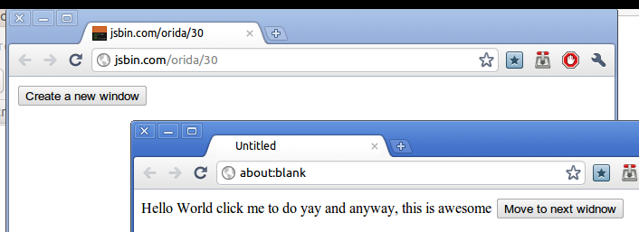

Web interfaces right now are either multi-window by design (and only multi-windowed), which aren't that common and are pretty annoying some times. Most of the time, it's single windowed, and all the document elements are constrained to a single web page. The problem with this, is that it's a lot less flexible, I can't have, for instance, for the ajax animator, I wouldn't be able to have the tools on the very left side, the timeline on the bottom, a web browser pointing at my RSS in between and the canvas on my second monitor (Not really a functional arrangement, but multiple monitors is a biggie). Even cooler, would be to have it all synchronized using Comet or WebSocket and having part of the interface on a separate device. For devices with smaller displays, like netbooks, I would imagine having a web application to seamlessly move the tools and preference panes to a, for instance, iPhone screen, would be awesome.

[http://jsbin.com/orida/30](http://jsbin.com/orida/30) is a tiny prototype where a new window can be created, and an element, along with event handlers (though only for a root node) gets moved into the new window with a reference to the first window.
