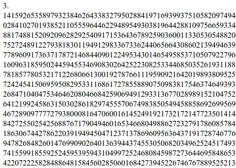

[
http://antimatter15.github.com/pi/partial.html](http://antimatter15.github.com/pi/partial.html)

It's not using the fastest algorithm, but the nice thing about this one is that it's capable of digit-extraction (calculating one section without knowing the digits before it) and was nice for doing[ distributed computin](2008/12/distributed-computing-take-iii/)g. This also has the nice side effect of working pretty well with the MapReduce paradigm (To calculate a block, calculate primes 3 to 2*N, map it all to the magical pi algorithm and then add it all up and truncate the [fractional part](http://mathworld.wolfram.com/FractionalPart.html), however it doesn't really use MapReduce because there aren't enough machines/threads to make it really necessary to distribute out the reducing part). So on the time-memory tradeoff scale, this algorithm uses low memory and is slower, which makes it pretty good for the purposes of something implemented with WebWorkers as I can't imagine it would be good to have the same data multiplied by the number of threads and having lots of data being passed with each postMessage.

