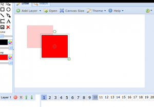
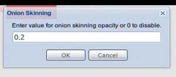

The Ajax Animator (Wave/Mini interface version) now has support for basic Onion skinning, where the last keyframe is semitransparently placed in the background to aid in the positioning of the next keyframe. It's now enabled by default at 20% opacity but can be disabled.

To disable it, click the advanced button on the right side of the toolbar and find the entry labeled Onion Skinning, there you can set the onion skinning opacity or disable it with 0% opacity.

