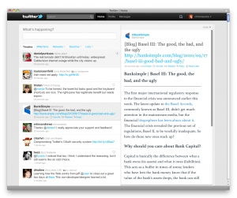

I was inspired by [chris messina](http://twitter.com/chrismessina/status/24791169387)'s idea of integrating Readability into a twitter client. Sadly, I don't have newtwitter yet, so I can't actually do that. But since I do have the ultrahackable Streamie client, I've updated[ my fork of streamie](http://antimatter15.streamie.org) with that functionality. It relies on [a chrome extension](https://chrome.google.com/extensions/detail/nahmdndkmncjhppbaomnecihdmijgmne) that sort of makes an exception to the cross domain policy that makes all frames with a URL that includes #readStyle automatically load the readability bookmarklet.

Inspired by this
