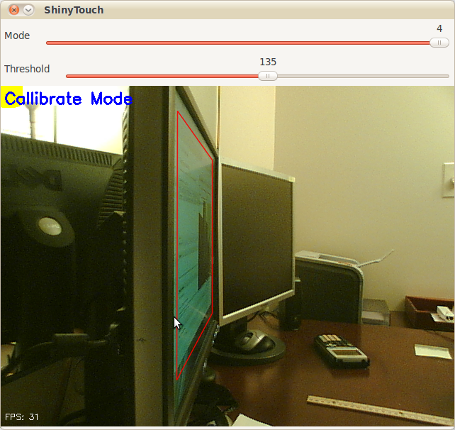

I have yet to give up entirely on [ShinyTouch](2009/07/shinytouch-zero-setup-single-touch-surface-retrofitting-technology/), my experiment into creating a touch screen input system which requires **virtually no setup**. For people who haven't read my posts from last year, it works because magically things look shinier when you look at it from an angle. And so if you mount a camera at an angle (It doesn't need to be as extreme as the screenshot above), you end up seeing a reflection on the surface of the screen (this could be aided by a transparent layer of acrylic or by having a glossy display, but as you can see, mine are matte, but they still work). The other pretty obvious idea of ShinyTouch, is that on a reflective surface, especially observed from a non-direct angle, you can see that the distance from the reflection (I guess my eighth grade science teacher would say the "virtual image") to the apparent finger, or "real image" is twice the distance from either to the surface of the display.  In other words, the **reflection gets closer to you when you get closer to the mirror**. A webcam usually gives a two-dimensional bitmap of data (and one non-spatial dimension of time). This gives (after a perspective transform) the **X and Y positions** of the finger. But an important aspect of a touchscreen and what this technology is also capable of, a "zero-touch screen", is a **Z axis: the distance of the finger and the screen**. A touchscreen has a binary Z-axis: touch or no touch. Since you can measure the **distance between the apparent real finger and it's reflection, you can get the Z-axis**. That's how ShinyTouch works.

Last year someone was interested and actually contributed some code. Eventually we both agreed that my code was crap so he decided to [rewrite](http://github.com/ddlshack/shinytouch) it, this time using less PIL and pixel manipulation, and instead, opting for more OpenCV so it's faster. The project died a bit early this year, and with nothing more to do,[ I decided to revive it](http://github.com/antimatter15/shinytouch). His code had some neat features:

*   Better perspective performs
*   Faster
*   Less Buggy
*   Simpler configuration (track bars instead of key combinations and editing JSON files)
*   Yellow square to indicate which corner to click when callibrating (actually, [I wrote](http://github.com/ddlshack/shinytouch/commit/9df521a08c8a12e6b8d1aa58d665394faaaac10f) that feature)
It was left however, at a pretty unfinished state. It couldn't do anything more than generate config files through a nice UI and doing a perspective transform on the raw video feed. So in the last few days, I added a few more features.

*   Convert perspective-transformed code into grayscale
*   Apply a 6x6 gaussian blur filter
*   Apply a binary threshold filter
*   Copy it over to PIL and shrink the canvas by 75% for performance reasons
*   Hack a Python flood-fill function to do blob detection (because I couldn't compile any python bindings for the opencv blob library)
*   Filter those blobs (sort of)
Basically, it means ShinyTouch can now do multi-touch. Though the Z-axis processing, which is really what the project is all about still sucks. Like it sucks _a lot_. But when it does work (on a rare occasion), **you get multitouch** (yay). If TUIO gets ported (again), it'll probably be able to interface with all the neat TUIO based apps.

Code here: [http://github.com/antimatter15/shinytouch/](http://github.com/antimatter15/shinytouch/) Please help, you probably don't want to try it (yet).
