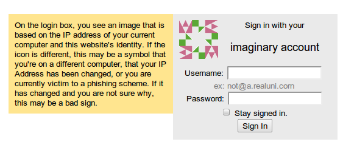

I just prototyped the anti phishing system described on [the earlier post](2010/11/insanely-simple-anti-phishing-system/). [Gareth Hayes](http://hackvertor.co.uk/public) noted that the the page could have been wrapped in an &lt;iframe&gt; to reuse the identicon. This implementation only shows the identicon if both javascript is present and functional and <tt>top==window</tt>. Hopefully there aren't many other huge flaws with it. So it would be awesome if you tried it out.
