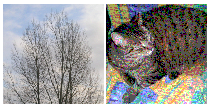

For no real reason, I was reading the Wikipedia article on [Digital Steganography](http://en.wikipedia.org/wiki/Steganography#Digital_steganography) and saw the interesting image where an image of a kitty is extracted from some boring trees. I decided to [port the example to &lt;canvas&gt;](http://antimatter15.com/misc/steganography.html).
