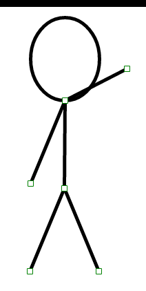

 Ubuntu's weird and adding a bar on top of all my screenshots

[http://antimatter15.com/ajaxanimator/VectorEditor/stickfigure.html](http://antimatter15.com/ajaxanimator/VectorEditor/stickfigure.html)

I like stick figures, and browsing YouTube, I found some things on Pivot and Pencil (really awesome free desktop animation apps), and that made me think, Stick figures are awesome. So I'm going to add some better Stick Figure features into Ajax Animator and possibly upstream to VectorEditor eventually.
