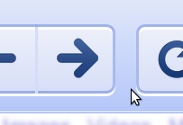

<dl id="attachment_1404" class="wp-caption alignnone" style="width: 213px;"><dd class="wp-caption-dd">Taken from the chromium site, which is really cool itself.</dd></dl>I would dare say that one of the least useful buttons on my browser has to be the Forward button. It's the analogue for the far more used back button, but most of the time, people progress forward, not [backward](http://www.jonathancoulton.com/wiki/index.php/De-Evolving) (obviously a pretty good thing). There's still a huge bit of potential for this underused button. I have[ a mouse](http://www.trust.com/products/product.aspx?artnr=15080) with buttons on the left side for navigating forward and back, It's really quite nice (though the triple-click button makes me develop a tendency to click randomly when reading, which makes those sites with the double-click lookup very annoying).

One of the most horrible developments in usability has been Pagination, because someone thought it would be a great idea to split everything into annoying separate pages. Sure it was a way to get around a technical issue of browser reflow while progressively rendering and bandwidth usage. But it set a nasty precedent for the future of web-interaction.

Now we have to live with it.

So I was thinking, is there any way to use my side buttons in Javascript? I quickly [prototyped](http://jsbin.com) a demo but to my dismay, clicks only triggered with a .button of 0, 1 or 2\. Then I realized that I could programatically alter history and detect hash changes. So then came another prototype which worked by setting the URL to "#Math.random()" and then doing a history.go(-1), hooking onto window.onhashchange to see when something changed. Then I discovered the new HTML5 history.pushState() and onpopstate events and switched accordingly.

Now, that it's possible to trick the browser into populating the[ future of history](http://ajaxian.com/archives/the-future-of-history). How do you decide what the user is probably going to next? The great thing is that if we guess wrong, it doesn't really matter, anything is still better than a non-functional forward button.

So how do you predict where the user wants to go next? In most paginated systems, on the top and/or bottom of a post is a series of links [1] [2] [3] [4]. The current page is usually grayed out and unclickable. This makes it pretty easy to detect, just iterate each link by node order, parseInt the innerText and see if there's a single-number jump in the middle, offset it by one and then you get the next page in order.

I actually wrote this such a long time ago that I basically forgot where the extension is and after using it, I've disabled it myself because chrome seems to have a few nasty bugs that cause it to crash (tabs at least) quite frequently when it's enabled. [But here it is.](https://gist.github.com/a828411054fe1de22be9)
