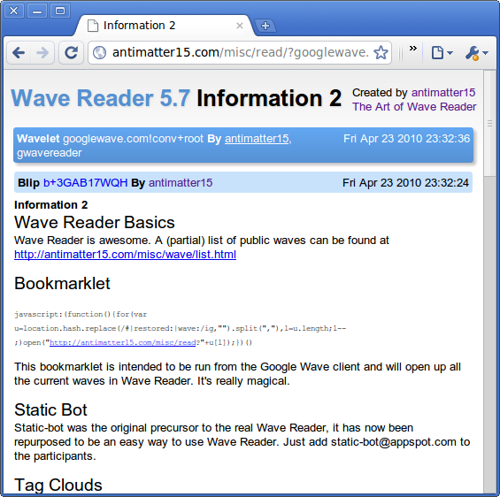

Wave Reader started around early December of 2009 to fill a somewhat significant void. Embedded waves could not be accessed by people who were not logged into their Google accounts, there was no way to link to a specific blip and the official wave client was insanely slow. Most of these issues have been mitigated, so the project is virtually defunct.

 

 
