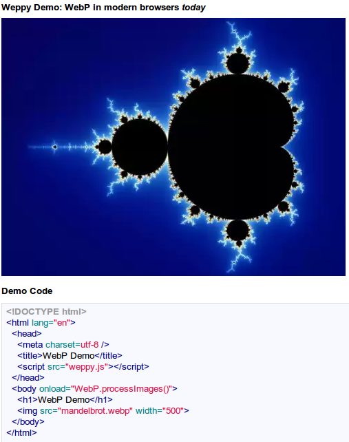

**WebP **[http://code.google.com/speed/webp/](http://code.google.com/speed/webp/)

Recently, Google announced a new lossy image compression codec, named WebP, intended to supersede JPEG. It is based on VP8's intraframe compression algorithm. It's not natively supported in any browsers yet. Weppy is a compatibility layer that changes WebP files into WebM files that can be loaded on several modern browsers.

**How does it work?**

WebP is actually a lightweight container for a single VP8 frame (whereas WebM is a container based off Matroska meant for video). WebM support exists already in Chrome, Firefox and Opera, so all that's needed to render it is to do a little magic to convert the RIFF encoded WebP image into a EBML/Matroska encoded single frame WebM video, loading it in a , using drawImage() on a  and replacing the .webp image with the data URL extracted from the  using toDataURL().
** Issues**

*   Chrome (on linux anyway) tends to crash a lot.
*   Firefox throws a security exception when doing toDataURL() on a canvas after drawImage() of a video loaded from a data url. The hack being used it to replace the image node with the actual canvas instance.
*   Opera doesn't work. I don't really have the time to investigate.
** What Browsers?**

Chrome 7.0 and Firefox 4.0 were both tested. Opera doesn't work for reasons that I'm not sure about. I would appreciate it if someone fixes it and submits a patch :)

**Demo**

[http://antimatter15.github.com/weppy/demo.html](http://antimatter15.github.com/weppy/demo.html)
