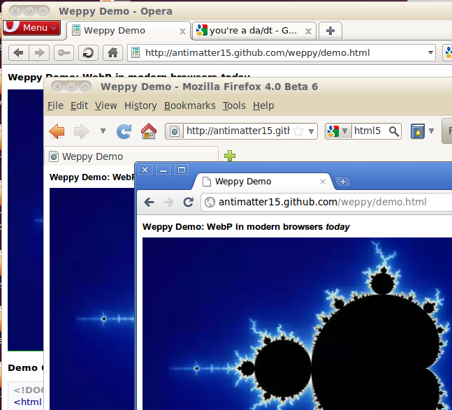

With help from [@Frenzie](http://twitter.com/Frenzie) and [@paul_irish](http://twitter.com/#!/paul_irish/status/26829179917), the latest not-yet-versioned release of Weppy, my Javascript WebP to WebM conversion library, or something of a [polyfill](http://remysharp.com/2010/10/08/what-is-a-polyfill/) for a format that is yet to be part of any specification ([HTML5 seems to specifically reference](http://dev.w3.org/html5/spec/Overview.html#attr-img-src) the image src attribute are examples such as PNG, GIF, JPEG, APNG, PDF, XML, SVG, SMIL, and MNG). The new release brings some awesome new features that really don't change much and shouldn't really be used in the real world because most browsers in the world still aren't Firefox, Chrome or Opera - that is, a large portion of the browser market includes browsers like Safari and IE, either suffering from antiquity (IE6! aah!) or just liking h264 (IE9 + Safari).

The new release supports Opera. I never bothered debugging Opera, I figured it was another huge issue that would demand a rewrite (as supporting Firefox had needed, because the order of the object keys isn't preserved and breaks the EBML result, or at least for Firefox's parser which seems to be somewhat stricter than Chrome's, is that ffmpeg?). And after premature optimization (stripping "unnecessary" EBML tags), my code didn't work in chrome, so I had to revert to an earlier revision. All my testing code was based on file drag-drop stuff, and Opera doesn't support that. Until I saw this [mozillazine topic](http://forums.mozillazine.org/viewtopic.php?p=9991409#p9991409), I didn't care, but it was a lot easier to fix than I feared.

Part of the solution was getting rid of the canvas stage. Admittedly, the canvas stage was pretty useless once the toDataURL() stage was removed before the first public release, but I didn't feel like deleting code, so it stayed there. Also, I noticed that the global variable that gets introduced was accidentally named "WebM", which is wrong, it should be "WebP", but because of the uncreative format naming and similarities, I didn't notice. Not sure, but it seems to be more stable now.

Chrome probably will add WebP soon, and it needs to be future proof, detecting whether or not a browser supports the WebP format. To do that, it creates an Image, sets the src to a data url of a 4x4 webp image and listens to the onload and onerror events, checking if the size is correct and there were no errors loading it. The routine is expected to error and totally untested as there aren't any browsers that support the feature yet for me to try.

Another change, is that by default, it will automatically load all the same-origin (because of the limitations of XHR) webp images (from &lt;img&gt; tags), on the DOMContentLoaded event, so the library is practically drop-in now. In any web page, you can pretty much add &lt;script src="[http://antimatter15.github.com/weppy/weppy.js](http://antimatter15.github.com/weppy/weppy.js)"&gt;&lt;/script&gt; and on the supported browsers, it should automatically load and replace all WebP images, though not something I would really recommended.

The demo is the same place it always was: [http://antimatter15.github.com/weppy/demo.html](http://antimatter15.github.com/weppy/demo.html)

There is also this nifty hack that uses &lt;canvas&gt; to add an alpha channel to the WebP image (adapted from the [original JPEG](http://blog.jackadam.net/2010/alpha-jpegs/) one): [http://antimatter15.github.com/weppy/alpha/alpha.html](http://antimatter15.github.com/weppy/alpha/alpha.html)

Also, please follow me[ on twitter](http://twitter.com/antimatter15).
