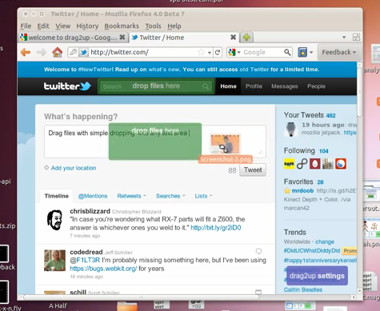
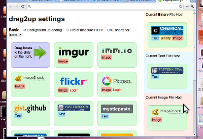

drag2up was a [browser extension I built a few months ago](2010/10/drag2up-drag-files-onto-any-site/), and recently bumped it up to 2.0\. The basic idea is to use HTML5 File API and the drag/drop integration that **Chrome and Firefox** implements to enable uploads to any website by[ simply dragging and dropping](http://www.youtube.com/watch?v=DBqxmO-ZrDY) the file from your computer onto the respective site. Instead of the trouble of opening a new tab, navigating to your favorite file provider, waiting for it to load, pressing the browse button, navigating to the folder with your image, pressing "Open", then hitting the submit button, waiting for the upload to finish, copy the link, find the original tab among the mess of tabs that fills your tab bar and finally scrolling down, selecting the box and pasting the URL. All to share a three megabyte file. drag2up streamlines the process into a single, swift gesture where you drag the file onto the text entry field. The link is instantly added while the file is being **uploaded in the background**. If someone navigates to the link before it's done uploading, the page uses the Google App Engine Channel API to stream **real time** upload status.

It still has a pretty simple user interface that works with **zero initial setup**. In addition to using gist and imgur for text files and image uploading respectively, it includes many additional services, configurable through a simple drag and drop interface. The new version also sports Firefox support.

**New Features**

*   Firefox + Chrome
*   Background Uploading
*   imgur, imm.io, ImageShack
*   Flickr, Picasa
*   gist, pastebin, mysticpaste
*   Chemical Servers, DAFK, Hotfile
*   Dropbox, CloudApp
*   Built in URL shorteners
Right now, the only service that doesn't quite work is Dropbox. The application hasn't been approved for production status yet. And a number of the hosts do not work with Chrome 8 because of typed arrays and binary XHR issues.

[**Try out** the extension now  :)](http://drag2up.appspot.com) I would really appreciate any and all feedback.

**Technical Information**

There's some pretty cool stuff going on in the new release. This release is really close to the bleeding edge of what's capable on the web and with browsers. On Chrome, to upload files, the multipart/form-data xhr is being pieced together with array buffers and typed arrays, stuff from the **WebGL** specification. The Firefox version is based on the latest beta release of **Mozilla Jetpack** (hacked slightly so that the resulting xpi works with 3.6 as well as 4.0). Transferring data between the background page and the individual content scripts (or pageMods in Jetpack's terms) is done with the createBlobURL (also called createObjectURL) function and binary XMLHttpRequest. On older versions of Firefox, FileReader is used to load files into base64 encoded data urls. Inter-frame communication is done with postMessage and native JSON serialization and parsing functions.  Picasa and Dropbox support are built on Javascript implementations of OAuth (based on [Clip It Good](https://github.com/bslatkin/clip-it-good) and [Chromepad](https://github.com/kenotron/chromepad)). So, yeah, there's lots of new and super cool stuff in there.

The content script was more or less rewritten in order to support Gmail, which led to some interesting design changes. Firstly, the new version establishes a sort of hierarchy, a difference between a root frame and the most subordinated one. Each drag event is sent to the top using postMessage, where the root frame decides whether or not to render the targets or to remove them. Once the decision is made, it [trickles downward](https://github.com/antimatter15/drag2up/blob/master/data/drag2up.js#L108) to each of it's immediate frames and then trickles back down to each subordinate frame. Whenever a frame is created, a loop detects that one has been added and attempts to access it's DOM in order to insert a script element that initializes the code. Interestingly, content scripts (in chrome) are unable to access the child frames so a script needs to be inserted into the immediate page in order to insert a script into a child page. The scripts also set document.__drag2up to ensure there aren't any frames that load themselves twice (interestingly creating an event and dispatching it seeing if there's a event listener that does preventDefault isn't a reliable indicator. I wanted to ideally create a system that was mostly undetectable by the parent page, but eventually settled for this simpler and more reliable implementation).

Once the "trickle_reactivate" message (every message happens to be eighteen characters, because  of certain really weird design ideas) is recieved by all the frames, they loop through all the elements on the page, searching for elements that meet the isDroppable criteria. It does not trigger on elements who have a width*height &lt; 100, so no really tiny boxes. It needs to be an input element type text or textarea that isn't read only or disabled, or it needs to be an element whose contents are editable. Then it checks the positioning of the element using the document.elementFromPoint function twice (one accounting for scrolling and one that doesn't to differentiate fixed positioning from others). The drop target is a div with a massive style attribute. It has rounded corners, css transitions and is positioned either absolutely or fixed based on the positioning of the associated input element. It's centered around the element or completely covers it for smaller areas. When the user hovers over it, the opacity changes (the behavior is actually reversed from the last version). The original version faded out slightly when hovered over, which, after some thought, I realized made no sense. Similar to the drop target is a purple settings box on the lower right corner. I'm actually quite displeased with it. It's not a great user experience, but at least it's noticable. Primarily, it was added because I have no idea how to get the Preferences button to work with Jetpack and Google manages to bury the Options button somewhere deep within the depths of Chrome's single menu.

Once the file is dropped, the content script decides whether it was a file that was dropped or an image that was dropped from some other page. If it's an image (because that's the simpler case to deal with), it does something that's actually slightly counterintuitive. Using getData('text/uri-list') isn't reliable as in many cases, the image is wrapped in a link tag and that only gives the link URL instead of that image. So instead, it reads text/html and inserts it into a temporary div and pulls out the source attribute which is then sent to the background page. If the thing that was dropped is a file, first, it checks if the browser supports one of the Blob URI creation methods and if that's available, it uses that to create a URL. If not, the file is read using FileReader as a base64 encoded data url and sent to the background page. But not immediately, because often the script is running in an unprivledged environment, so it does a postMessage to the topmost parent which should be privileged. The privileged content script sends the message to the even more privileged background page that initiates the actual uploading process.

Before going into what the background page actually does, there's the settings page. I'm actually pretty proud of how it turned out. With the large number of hosts that are supported, I needed a way for the user to select hosts for different types of files. I could have used select boxes, but they're not generally great when dealing with image based concepts, because a company's logo is often more recognizable than the name (odd that I'm saying that, seeing as this blog has neither a distinctive name nor even a favicon). So instead, I built this little grid where the user can drag hosts into boxes on the right. It's made with jQuery UI, because I don't particularly like the API's provided in HTML5.

The background page handles the uploading. Basically, there's a bunch of javascript files that are loaded into it. The hardest part was by far, OAuth. If anything, this project has only refined my dislike of OAuth. And because this post is already insanely long, I'll go and rant about the problems of OAuth anyway. There's already[ a great article on how terrible of an idea](http://arstechnica.com/security/guides/2010/09/twitter-a-case-study-on-how-to-do-oauth-wrong.ars) it is for OAuth to be used in any application that runs code on the client. But Photobucket, Picasa and Dropbox still don't understand that (or don't care) and only provide OAuth. But that's not really a problem, I just hate OAuth because even though It's a standard, each service provider has some little quirks that take hours to debug and ends up being extremely frustrating. Maybe the OAuth gods are angry with me or something, but it's incredibly troublesome.

[Try out the extension now  :)](http://drag2up.appspot.com) I would really appreciate any and all feedback.
