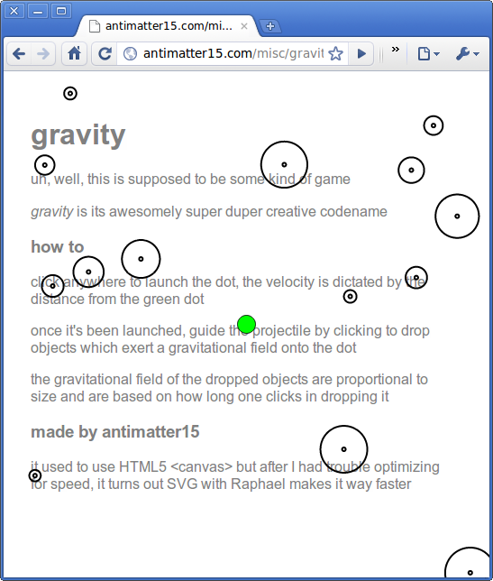

[Here's my foray into the flash-esque html5 game arena](http://antimatter15.com/misc/gravity2.html). It's a simple game built initially in &lt;canvas&gt; but later scrapped for Raphael because I guess it's something more suitable for svg than canvas. The interface is fairly simple, you **click to start the game**, where your projectile is sent off at the velocity relative to green blob in the center. Once it's launched, the projectile is affected by the gravitational field of all the planets in some fairly pretty near-orbits. Once the projectile is in motion, **clicking drops a new planet** at where your cursor is, **holding down makes the planet grow**. The objective is to have the projectile not accelerate off the screen.

As per [Kepler's laws](http://en.wikipedia.org/wiki/Kepler), getting near a planet produces the ["gravitational slingshot"](http://en.wikipedia.org/wiki/Gravity_assist) effect. Since the projectile tends to fly toward the center of planets, a magical [divide-by-zero](http://en.wikipedia.org/wiki/Divide_by_zero) causes the infinite acceleration toward doom.

As with several other of my  recent projects, it supports various configuration options via the url query string. If you don't know how it works, basically, you append ?opt1=val1&amp;opt2... to the url. Example: [gravity2.html?grav=4](http://antimatter15.com/misc/gravity2.html?grav=4) , simply [gravity2.html?fastest](http://antimatter15.com/misc/gravity2.html?fastest) or a combo of [gravity2.html?fastest&amp;grav=4&amp;random](http://antimatter15.com/misc/gravity2.html?fastest&amp;grav=4&amp;random). The current options are _fastest_ to prevent the targeting of 80fps (accepts no args), _target_ the target fps (obviously can not be used with fastest, in the case, _fastest_ takes precedence) and it accepts one numerical argument, the default is 80\. _grav_ accepts one numerical argument, the default is 4 and is the attraction of the planets ([zero isn't very fun](http://antimatter15.com/misc/gravity2.html?grav=0)). _random _makes the planets start off in random places rather than the predefined magical positioning.

Feel free to post highscores in the comments.
