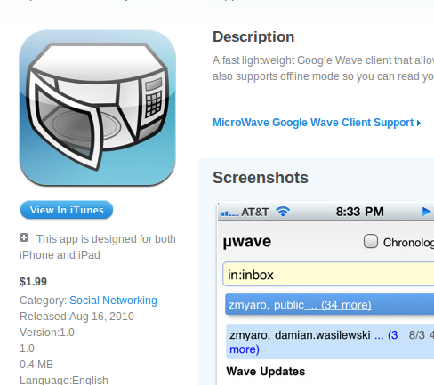

[http://itunes.apple.com/us/app/microwave-google-wave-client/id386081118?mt=8](http://itunes.apple.com/us/app/microwave-google-wave-client/id386081118?mt=8)

So microwave is now on the app store. Though wave was just announced to be shut down, I had the app done already (though I was waiting for a wave server update so thread continuation and attachment uploading would work), and I just published it anyway[. So here it is. Grab it while wave still works :).](http://itunes.apple.com/us/app/microwave-google-wave-client/id386081118?mt=8) It supports offline, so you can cache some waves and read them on-the-go.
