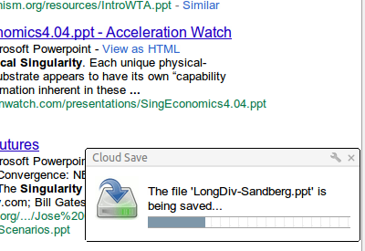

So, I finally updated my most popular browser extension:[ Cloud Save](https://chrome.google.com/webstore/detail/omiekjeapoonbhiemenfoccbdpeagdah). This adoption has always sort of puzzled me, as it was originally simply a 30 minute hack on drag2up. So I'm trying to be careful not to introduce any huge changes in fear of alienating that magical use case that everyone else seems to have stumbled upon.

Nevertheless, 1.3 introduces lots of useful features. First and foremost is the introduction of a progress bar. I really can't imagine using it without the progress bar or some other indicator - like how it was in the last version (yet how people still found it useful absolutely bewilders me). The progress dialog is awesome and probably the most significant feature, and after that was just a few backend changes which enabled this.

Published retroactively on 10/22/11
